# Authentication & Navigation Flow Diagrams

This document contains Mermaid diagrams showing the various authentication flows and navigation paths based on Firestore field values, flags, and routing rules defined in `navigation.ts`.

## Table of Contents

1. [Individual User Type Flows](#individual-user-type-flows)
   - [Free Account (Verified Email)](#free-account-verified-email)
   - [Free Account (Unverified Email)](#free-account-unverified-email)
   - [Paid Account Signup (New User, Verified)](#paid-account-signup-new-user-verified)
   - [Paid Account Signup (New User, Unverified)](#paid-account-signup-new-user-unverified)
   - [Paid Account (After Payment)](#paid-account-after-payment)
   - [Trial Account](#trial-account)
   - [Inactive Subscription](#inactive-subscription)
   - [Past Due Subscription](#past-due-subscription)
   - [Cancelled Subscription](#cancelled-subscription)
   - [Expiring Subscription Warning](#expiring-subscription-warning)
2. [Combined Flow Diagram](#combined-flow-diagram)

---

## Individual User Type Flows

### Free Account (Verified Email)

**User State:**

- `user.isEmailVerified = true`
- `subscription.plan = FREE`
- `subscription.status = ACTIVE` or `TRIALING`
- `setup.firstTimeSetup = true` (new user) or `false` (returning)
- `setup.showOnboarding = true` (first session) or `false` (subsequent)

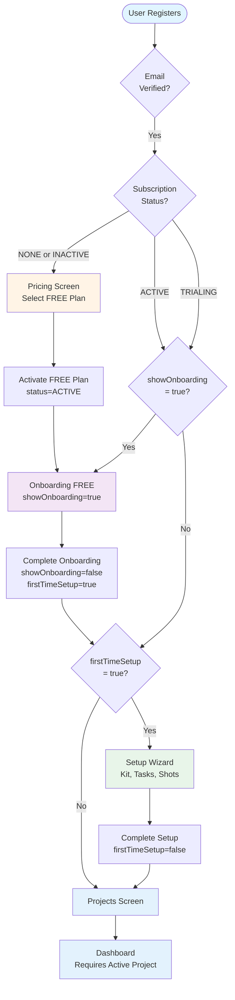

### Free Account (Unverified Email)

**User State:**

- `user.isEmailVerified = false`
- `subscription.plan = FREE`
- `subscription.status = ACTIVE` or `TRIALING`
- `setup.skippedEmailVerification = false` (default)

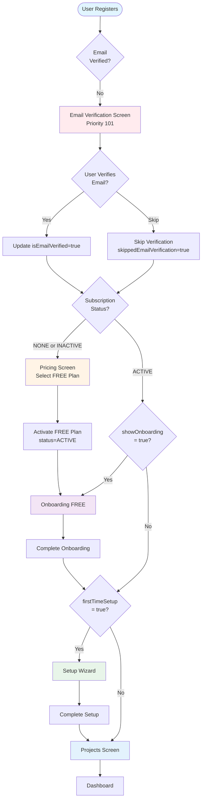

### Paid Account Signup (New User, Verified)

**User State:**

- `user.isEmailVerified = true`
- `subscription.plan = NONE` or `FREE`
- `subscription.status = NONE` or `INACTIVE`
- `setup.firstTimeSetup = true`

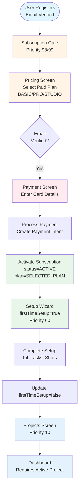

### Paid Account Signup (New User, Unverified)

**User State:**

- `user.isEmailVerified = false`
- `subscription.plan = NONE` or `FREE`
- `subscription.status = NONE` or `INACTIVE`
- `setup.firstTimeSetup = true`
- `setup.skippedEmailVerification = false`

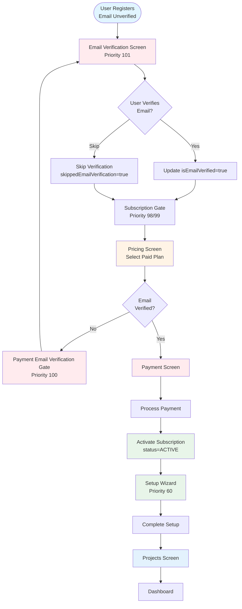

### Paid Account (After Payment)

**User State:**

- `user.isEmailVerified = true`
- `subscription.plan = BASIC/PRO/STUDIO`
- `subscription.status = ACTIVE`
- `setup.firstTimeSetup = true` (first payment) or `false` (upgrade)

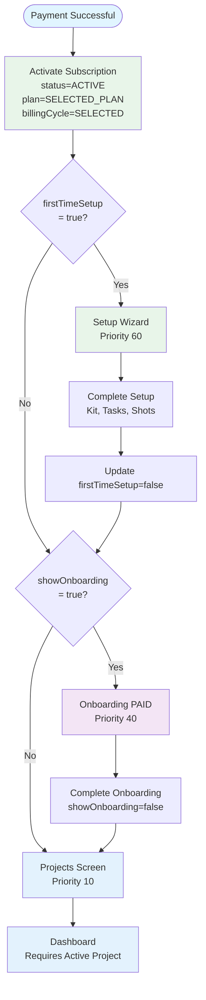

### Trial Account

**User State:**

- `subscription.plan = BASIC/PRO/STUDIO`
- `subscription.status = TRIALING`
- `subscription.trialEndsAt = FUTURE_DATE`
- `setup.showOnboarding = true`

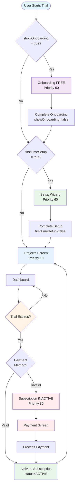

### Inactive Subscription

**User State:**

- `subscription.status = INACTIVE`
- `subscription.isActive = false`

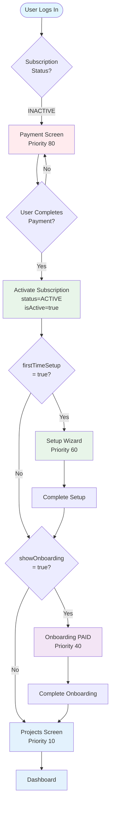

### Past Due Subscription

**User State:**

- `subscription.status = PAST_DUE`
- `subscription.isActive = false`
- Payment method failed or expired

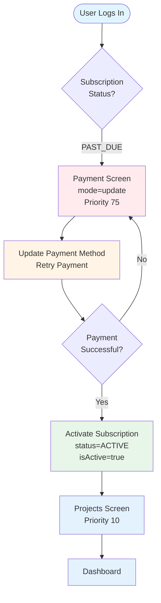

### Cancelled Subscription

**User State:**

- `subscription.status = CANCELLED`
- `subscription.isActive = false`
- `subscription.autoRenew = false`
- `subscription.cancelledAt = DATE`

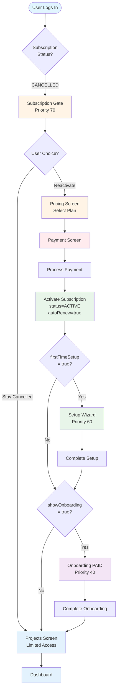

### Expiring Subscription Warning

**User State:**

- `subscription.plan = BASIC/PRO/STUDIO` (not FREE)
- `subscription.status = ACTIVE`
- `subscription.autoRenew = false`
- `subscription.endDate = DATE` (within warning days: 14, 10, 7, 3, 2, 1)
- `sessionFlags.hasSeenExpiryWarning = false`

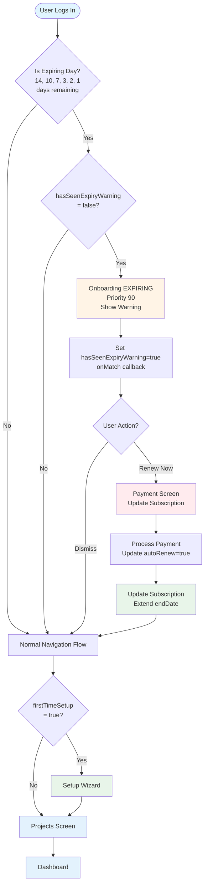

---

## Combined Flow Diagram

This diagram shows the complete navigation flow with all routing rules and priorities.

```mermaid
flowchart TD
    Start([App Launch / User Action]) --> AuthCheck{User<br/>Authenticated?}

    AuthCheck -->|No| Auth[Auth Screens<br/>Sign In / Register]
    AuthCheck -->|Yes| LoadUser[Load User Data<br/>user, subscription, setup]

    Auth --> Register[Register Screen]
    Register --> CheckEmailReg{Email<br/>Verified?}

    CheckEmailReg -->|No| VerifyEmailReg[Email Verification<br/>Priority 101]
    CheckEmailReg -->|Yes| SubscriptionGateReg[Subscription Gate]

    VerifyEmailReg --> UserVerifies{User Verifies?}
    UserVerifies -->|Yes| UpdateEmail[Update isEmailVerified]
    UserVerifies -->|Skip| SkipVerification[Skip Verification]

    UpdateEmail --> SubscriptionGateReg
    SkipVerification --> SubscriptionGateReg

    LoadUser --> EvaluateRules[Evaluate Routing Rules<br/>Priority Order]

    %% Priority 101: Email Verification
    EvaluateRules --> Rule101{Email Verified?<br/>Priority 101}
    Rule101 -->|No & Not Skipped| VerifyEmail[Email Verification Screen]
    Rule101 -->|Yes or Skipped| Rule100

    %% Priority 100: Payment Email Verification Gate
    Rule100{On Payment Route?<br/>Priority 100}
    Rule100 -->|Yes & Not Verified| VerifyEmail
    Rule100 -->|No or Verified| Rule99

    %% Priority 99: No Plan Pricing
    Rule99{Plan = NONE?<br/>Priority 99}
    Rule99 -->|Yes & firstTimeSetup| Pricing99[Pricing Screen]
    Rule99 -->|No| Rule98

    %% Priority 98: Newly Registered Pricing
    Rule98{Status = INACTIVE?<br/>Priority 98}
    Rule98 -->|Yes & firstTimeSetup| Pricing98[Pricing Screen]
    Rule98 -->|No| Rule90

    %% Priority 90: Expiry Warning
    Rule90{Is Expiring Day?<br/>Priority 90}
    Rule90 -->|Yes & Not Seen| ExpiryWarning[Onboarding EXPIRING]
    Rule90 -->|No| Rule80

    %% Priority 80: Inactive Subscription
    Rule80{Status = INACTIVE?<br/>Priority 80}
    Rule80 -->|Yes| Payment80[Payment Screen]
    Rule80 -->|No| Rule75

    %% Priority 75: Past Due
    Rule75{Status = PAST_DUE?<br/>Priority 75}
    Rule75 -->|Yes| Payment75[Payment Screen<br/>mode=update]
    Rule75 -->|No| Rule70

    %% Priority 70: Cancelled
    Rule70{Status = CANCELLED?<br/>Priority 70}
    Rule70 -->|Yes| SubscriptionGate70[Subscription Gate]
    Rule70 -->|No| Rule65

    %% Priority 65: Free Plan Onboarding
    Rule65{Plan = FREE?<br/>Priority 65}
    Rule65 -->|Yes & Not Seen| OnboardingFree[Onboarding FREE]
    Rule65 -->|No| Rule60

    %% Priority 60: Active First Time Setup
    Rule60{Status = ACTIVE?<br/>Priority 60}
    Rule60 -->|Yes & firstTimeSetup & Verified| Setup[Setup Wizard]
    Rule60 -->|No| Rule50

    %% Priority 50: Dashboard Project Guard
    Rule50{On Dashboard?<br/>Priority 50}
    Rule50 -->|Yes & No Project| Projects50[Projects Screen]
    Rule50 -->|No| Rule50b

    %% Priority 50: Trialing Onboarding
    Rule50b{Status = TRIALING?<br/>Priority 50}
    Rule50b -->|Yes & showOnboarding| OnboardingFree
    Rule50b -->|No| Rule40

    %% Priority 40: Active Onboarding
    Rule40{Status = ACTIVE?<br/>Priority 40}
    Rule40 -->|Yes & showOnboarding| OnboardingPaid[Onboarding PAID]
    Rule40 -->|No| Rule10

    %% Priority 10: Default Projects
    Rule10[Projects Screen<br/>Priority 10]

    %% Payment Flow
    Payment80 --> ProcessPayment[Process Payment]
    Payment75 --> ProcessPayment
    ProcessPayment --> ActivateSubscription[Activate Subscription<br/>status=ACTIVE]
    ActivateSubscription --> Setup

    %% Pricing Flow
    Pricing99 --> SelectPlan{Select Plan}
    Pricing98 --> SelectPlan
    SubscriptionGateReg --> SelectPlan
    SubscriptionGate70 --> SelectPlan

    SelectPlan -->|FREE| ActivateFree[Activate FREE Plan]
    SelectPlan -->|Paid| CheckEmailPricing{Email Verified?}

    CheckEmailPricing -->|No| VerifyEmail
    CheckEmailPricing -->|Yes| Payment[Payment Screen]

    Payment --> ProcessPayment

    ActivateFree --> OnboardingFree

    %% Onboarding Flows
    OnboardingFree --> CompleteOnboarding[Complete Onboarding<br/>showOnboarding=false]
    OnboardingPaid --> CompleteOnboarding
    ExpiryWarning --> CompleteOnboarding

    CompleteOnboarding --> EvaluateRules

    %% Setup Flow
    Setup --> CompleteSetup[Complete Setup<br/>firstTimeSetup=false]
    CompleteSetup --> EvaluateRules

    %% Projects Flow
    Rule10 --> Projects[Projects Screen]
    Projects50 --> Projects
    Projects --> SelectProject{Select Project}
    SelectProject --> Dashboard[Dashboard<br/>Active Project Required]

    VerifyEmail --> EvaluateRules

    style Start fill:#e1f5ff
    style Auth fill:#ffebee
    style VerifyEmail fill:#ffebee
    style Pricing99 fill:#fff4e6
    style Pricing98 fill:#fff4e6
    style Payment fill:#ffebee
    style Payment80 fill:#ffebee
    style Payment75 fill:#ffebee
    style ExpiryWarning fill:#fff4e6
    style SubscriptionGate70 fill:#fff4e6
    style OnboardingFree fill:#f3e5f5
    style OnboardingPaid fill:#f3e5f5
    style Setup fill:#e8f5e9
    style Projects fill:#e3f2fd
    style Dashboard fill:#e3f2fd
    style ActivateSubscription fill:#e8f5e9
    style ActivateFree fill:#e8f5e9
```

---

## Key Routing Rules Summary

| Priority | Rule ID                     | Condition                                                | Target Route                  | Description                                |
| -------- | --------------------------- | -------------------------------------------------------- | ----------------------------- | ------------------------------------------ |
| 101      | email-verification          | `!isEmailVerified && !skippedEmailVerification`          | `VERIFY_EMAIL`                | Unverified users must verify email         |
| 100      | payment-verification-gate   | `!isEmailVerified && route.startsWith('/(payment)')`     | `VERIFY_EMAIL`                | Payment routes require email verification  |
| 99       | no-plan-pricing             | `plan === NONE && firstTimeSetup`                        | `SUBSCRIPTION_PRICING`        | Users without plan must select one         |
| 98       | newly-registered-pricing    | `status === INACTIVE && firstTimeSetup`                  | `SUBSCRIPTION_PRICING`        | Newly registered users must select plan    |
| 90       | subscription-expiry-warning | `isExpiringDay(endDate) && !hasSeenExpiryWarning`        | `ONBOARDING_EXPIRING`         | Show expiry warning on specific days       |
| 80       | inactive-subscription       | `status === INACTIVE`                                    | `PAYMENT_INDEX`               | Inactive subscriptions need payment        |
| 75       | past-due-subscription       | `status === PAST_DUE`                                    | `PAYMENT_INDEX` (mode=update) | Past due subscriptions need payment update |
| 70       | cancelled-subscription      | `status === CANCELLED`                                   | `SUBSCRIPTION_GATE`           | Cancelled subscriptions need reactivation  |
| 65       | free-plan-onboarding        | `plan === FREE && !hasSeenFreeWelcome`                   | `ONBOARDING_FREE`             | Free users see onboarding every launch     |
| 60       | active-first-time-setup     | `status === ACTIVE && firstTimeSetup && isEmailVerified` | `SETUP_INDEX`                 | Verified active users go through setup     |
| 50       | dashboard-project-guard     | `route.startsWith('/(dashboard)') && !activeProjectId`   | `PROJECTS_INDEX`              | Dashboard requires active project          |
| 50       | trialing-onboarding         | `status === TRIALING && showOnboarding`                  | `ONBOARDING_FREE`             | Trialing users see free onboarding         |
| 40       | active-onboarding           | `status === ACTIVE && showOnboarding`                    | `ONBOARDING_PAID`             | Active paid users see paid onboarding      |
| 10       | default-projects            | `true` (always matches)                                  | `PROJECTS_INDEX`              | Default route for all other users          |

---

## Firestore Field Reference

### User Document (`/users/{userId}`)

- `isEmailVerified: boolean` - Email verification status
- `isActive: boolean` - Account active status
- `isBanned: boolean` - Account ban status

### Subscription Subcollection (`/users/{userId}/subscription/{subscriptionId}`)

- `plan: SubscriptionPlan` - Plan type (NONE, FREE, BASIC, PRO, STUDIO)
- `status: SubscriptionStatus` - Status (NONE, INACTIVE, TRIALING, ACTIVE, PAST_DUE, EXPIRED, CANCELLED)
- `isActive: boolean` - Subscription active flag
- `autoRenew: boolean` - Auto-renewal enabled
- `endDate: Date` - Subscription end date
- `trialEndsAt: Date` - Trial end date

### Setup Subcollection (`/users/{userId}/setup/{setupId}`)

- `firstTimeSetup: boolean` - First time setup flag
- `showOnboarding: boolean` - Show onboarding flag
- `skippedEmailVerification: boolean` - Email verification skipped flag

### Session Flags (In-Memory)

- `hasSeenExpiryWarning: boolean` - Expiry warning seen this session
- `hasSeenFreeWelcome: boolean` - Free welcome seen this session

---

## Notes

1. **Priority System**: Routing rules are evaluated in priority order (highest first). The first matching rule determines navigation.

2. **Email Verification**:
   - Required for payment routes (Priority 100)
   - Can be skipped for free accounts
   - Social sign-in users may already have verified emails

3. **Onboarding**:
   - Free users see onboarding every launch (session flag)
   - Paid users see onboarding once (showOnboarding flag)
   - Expiring subscriptions show warning onboarding

4. **Setup Wizard**:
   - Only shown for verified users with active subscriptions
   - Completed when `firstTimeSetup` is set to `false`

5. **Payment Flow**:
   - After successful payment, users go to Setup (if firstTimeSetup) or Projects
   - Payment screen requires email verification

6. **Dashboard Access**:
   - Requires an active project selection
   - Redirects to Projects screen if no active project
