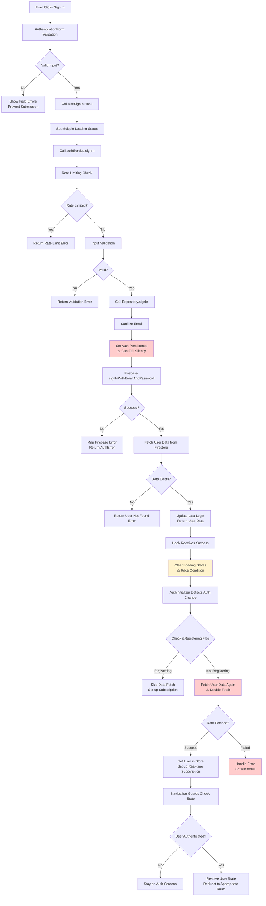

# Sign-In Flow Analysis Report

## Executive Summary

The sign-in flow in Eye-Doo involves multiple layers of validation, rate limiting, Firebase authentication, and state synchronization. While the architecture follows a clean separation of concerns (UI → Hook → Service → Repository → Firebase), there are several race conditions, error handling issues, and state management problems that can cause authentication failures, loading inconsistencies, and poor user experience.

## Architecture Overview

```
SignInScreen → useSignIn Hook → AuthService → AuthRepository → Firebase Auth → AuthInitializer → Navigation Guards
```

## Detailed Flow Analysis

### Step 1: User Input & Form Validation

**Code Location**: `src/components/auth/AuthenticationForm.tsx` & `src/app/(auth)/sign-in.tsx`

**Flow**:

1. User enters email/password in AuthenticationForm
2. Form validates input using Zod schema (`signInInputSchema`)
3. Form calls `onSubmit` callback with validated data
4. Screen calls `useSignIn().signIn(data)`

**Issues Identified**:

#### ✅ **GOOD**: Client-Side Validation

- Uses Zod schema for type-safe validation
- Real-time field validation with error display
- Form prevents submission with invalid data

#### ⚠️ **ISSUE**: Loading State Conflicts

```typescript
// In sign-in screen
const isLoading = loading || isInitializing;

// In useSignIn hook
const [localLoading, setLocalLoading] = useState(false);
setLoading(true); // Global loading
```

**Problems**:

- Three loading states: `localLoading` (hook), `loading` (store), `isInitializing` (store)
- Screen combines `loading || isInitializing` but doesn't account for `localLoading`
- Can cause inconsistent loading UI

### Step 2: Hook-Level Processing

**Code Location**: `src/hooks/use-auth-actions.ts` - `useSignIn`

**Flow**:

1. Set multiple loading states (`localLoading`, `loading`)
2. Call `authService.signIn(input)`
3. Handle success/error
4. Reset loading states

**Issues Identified**:

#### 🚨 **CRITICAL BUG**: Loading State Reset Race Condition

```typescript
try {
  const result = await authService.signIn(input);
  if (!result.success) {
    setError(result.error);
    return false;
  }
  return true;
} catch (error) {
  setError(error as AppError);
  return false;
} finally {
  setLocalLoading(false);
  setLoading(false); // Global loading
}
```

**Problems**:

- If `authService.signIn` throws an exception, `setError` is called twice (once in catch, once potentially in service)
- Loading states are reset in `finally` even if AuthInitializer is still processing
- AuthInitializer may set its own loading state after this hook clears it

#### ⚠️ **ISSUE**: Error Handling Inconsistency

```typescript
if (!result.success) {
  setError(result.error);
  handleError(result.error, ErrorContextBuilder.fromHook('useSignIn', 'signIn'));
  return false;
} catch (error) {
  const appError = error as AppError;
  setError(appError);
  handleError(appError, ErrorContextBuilder.fromHook('useSignIn', 'signIn'));
  return false;
}
```

**Problems**:

- Double error handling (both in service and hook)
- Error context is created in hook but service already has context
- Potential for duplicate error logging

### Step 3: Service-Level Validation & Rate Limiting

**Code Location**: `src/services/auth-service.ts` - `signIn`

**Flow**:

1. Rate limiting check using `signInRateLimiter`
2. Input validation with Zod schema
3. Retry logic for network errors
4. Call repository

**Issues Identified**:

#### ✅ **GOOD**: Rate Limiting Implementation

```typescript
if (!signInRateLimiter.canAttempt(rateKey)) {
  const minutesRemaining = Math.ceil(signInRateLimiter.getTimeUntilUnblocked(rateKey) / 60000);
  return err(/* user-friendly error */);
}
```

**Strengths**:

- Prevents brute force attacks
- User-friendly error messages with time remaining
- Automatic rate limit reset on success

#### ⚠️ **ISSUE**: Retry Logic Without User Feedback

```typescript
return await retryOnNetworkError(() => this.authRepository.signIn(input));
```

**Problems**:

- Network retries happen without user feedback
- No indication that retry is happening
- If all retries fail, user gets final error without knowing retries occurred

#### ✅ **GOOD**: Input Sanitization

- Email sanitization before Firebase calls
- Consistent validation patterns

### Step 4: Repository-Level Firebase Operations

**Code Location**: `src/repositories/firestore/firestore-auth-repository.ts` - `signIn`

**Flow**:

1. Sanitize email input
2. Set auth persistence (web only)
3. Call `signInWithEmailAndPassword`
4. Fetch user data from Firestore
5. Update last login timestamp

**Issues Identified**:

#### 🚨 **CRITICAL BUG**: Persistence Setting Failure Handling

```typescript
try {
  const persistence = payload.rememberMe ? browserLocalPersistence : browserSessionPersistence;
  await setPersistence(auth, persistence);
} catch (persistenceError) {
  // Log warning but continue with sign-in
  LoggingService.warn('Failed to set auth persistence...', {
    error: persistenceError.message,
    rememberMe: payload.rememberMe,
  });
  // Continue with sign-in
}
```

**Problems**:

- `setPersistence` can fail on React Native (not supported)
- Error is logged but sign-in continues, potentially with wrong persistence
- No fallback logic for persistence failures

#### ✅ **GOOD**: Last Login Update

```typescript
await this.userRepository.updateLastLogin(userCredential.user.uid).catch(error => {
  LoggingService.warn('Failed to update last login timestamp', { ... });
});
```

**Strengths**:

- Non-blocking operation (won't fail sign-in)
- Proper error logging
- Graceful degradation

#### ⚠️ **ISSUE**: Double Data Fetching

**Problem**: Repository fetches user data immediately after sign-in, but AuthInitializer will fetch it again.

**Impact**:

- Unnecessary Firestore reads
- Potential for data inconsistency if document changes between fetches
- Performance overhead

### Step 5: Auth State Synchronization

**Code Location**: `src/components/auth/AuthInitializer.tsx`

**Flow**:

1. Detects Firebase auth state change (`onAuthStateChanged`)
2. Checks `isRegistering` flag
3. Fetches user data from Firestore
4. Sets up real-time subscription
5. Updates auth store

**Issues Identified**:

#### 🚨 **CRITICAL BUG**: Race Condition with Sign-In Completion

**Scenario**: Sign-in completes successfully but AuthInitializer runs before Firebase auth state propagates.

```typescript
onAuthStateChanged(auth, async (firebaseUser: FirebaseUser | null) => {
  if (!firebaseUser) {
    // User signed out or sign-in failed
    setUser(null);
    setInitializing(false);
    return;
  }

  // Check isRegistering flag (for registration race condition)
  if (isRegistering) {
    // Skip fetch during registration
  }

  // Fetch user data for sign-in
  const result = await userService.getUser(firebaseUser.uid);
  // ... handle result
});
```

**Problems**:

- If `onAuthStateChanged` fires before sign-in promise resolves, AuthInitializer might not have user data yet
- AuthInitializer assumes user data exists when Firebase user is present
- No timeout or retry logic for missing user documents

#### ⚠️ **ISSUE**: Complex State Management

**Problem**: AuthInitializer manages three different states:

- `setInitializing(true)` - App initialization
- `setLoading(true)` - Data fetching during sign-in
- `isRegistering` - Registration flag

**Impact**:

- State management is scattered across multiple components
- Hard to track which component "owns" which state
- Potential for states to get out of sync

### Step 6: Navigation & Route Guards

**Code Location**: `src/app/(auth)/_layout.tsx` & `src/app/(protected)/_layout.tsx`

**Flow**:

1. Auth layout checks authentication status
2. If authenticated, redirects using `useUserState`
3. Protected layout ensures authentication

**Issues Identified**:

#### ⚠️ **ISSUE**: Double State Resolution

```typescript
// In auth layout
const { user, loading, isRegistering } = useAuthStore();
const { state, loading: stateLoading } = useUserState();
```

**Problems**:

- Two separate hooks resolving user state
- Potential for state to be out of sync
- Complex conditional logic

#### ✅ **GOOD**: Proper Redirect Logic

- Uses `UserStateResolver` for consistent redirects
- Handles different user states (onboarding, setup, etc.)

## Race Conditions & Timing Issues

### 1. **Firebase Auth State vs User Document Creation**

**Problem**: Firebase auth succeeds but Firestore user document isn't created yet by Cloud Functions.

**Impact**:

- AuthInitializer tries to fetch non-existent user data
- User sees error or loading screen indefinitely
- Sign-in appears to fail

**Current Mitigation**: Repository waits for documents in registration, but not sign-in.

### 2. **Loading State Synchronization**

**Problem**: Multiple components set loading states asynchronously.

**Scenario**:

1. `useSignIn` sets `loading = true`
2. Firebase sign-in succeeds
3. `useSignIn` sets `loading = false`
4. `AuthInitializer` starts fetching data, but loading is already false
5. User sees brief flash of content before loading starts again

### 3. **Auth State Change Timing**

**Problem**: `onAuthStateChanged` can fire at unpredictable times.

**Impact**:

- AuthInitializer might run multiple times
- State updates can conflict
- Loading states get out of sync

## Error Handling Issues

### 1. **Silent Persistence Failures**

```typescript
} catch (persistenceError) {
  // Log but continue - WRONG for critical auth operations
}
```

**Problem**: Persistence setting is critical for user experience but failures are ignored.

### 2. **Inconsistent Error Contexts**

**Problem**: Error contexts are built differently across layers:

- Service: `ErrorContextBuilder.fromService()`
- Repository: `ErrorContextBuilder.fromRepository()`
- Hook: `ErrorContextBuilder.fromHook()`

### 3. **Missing Error Recovery**

- No retry mechanisms for transient failures
- No offline handling
- No graceful degradation for service failures

## State Inconsistencies

### 1. **Loading State Conflicts**

**Problem**: Three loading states managed by different components:

- `useSignIn.localLoading`
- `useAuthStore.loading`
- `useAuthStore.isInitializing`

### 2. **User Data Synchronization**

**Problem**: User data fetched twice:

- Once in repository after sign-in
- Once in AuthInitializer

### 3. **Auth State vs User State**

**Problem**: Two sources of truth:

- Raw Firebase user (auth state)
- Resolved user state (permissions, redirects)

## Recommended Fixes

### 1. **Consolidate Loading States**

Create a single loading state machine:

```typescript
type AuthLoadingState = 'idle' | 'signing-in' | 'fetching-user-data' | 'ready' | 'error';
```

### 2. **Fix Auth State Synchronization**

```typescript
// In AuthInitializer
onAuthStateChanged(auth, async firebaseUser => {
  if (!firebaseUser) {
    setAuthState('signed-out');
    return;
  }

  // Wait for user document with timeout
  const userData = await waitForUserDocument(firebaseUser.uid, { timeoutMs: 10000 });

  if (userData) {
    setUser(userData);
    setAuthState('ready');
  } else {
    setAuthState('error');
    // Handle missing user document
  }
});
```

### 3. **Remove Double Data Fetching**

```typescript
// Repository signIn should NOT fetch user data
async signIn(payload: SignInInput): Promise<Result<void, AuthError>> {
  // Just authenticate with Firebase
  await signInWithEmailAndPassword(auth, email, password);
  return ok(undefined);
}

// Let AuthInitializer handle data fetching
```

### 4. **Add Retry Logic with User Feedback**

```typescript
const signInWithRetry = async (input: SignInInput, onRetry: (attempt: number) => void) => {
  for (let attempt = 1; attempt <= 3; attempt++) {
    try {
      onRetry(attempt);
      const result = await authService.signIn(input);
      if (result.success) return result;
      if (!result.error.retryable) return result;
    } catch (error) {
      if (attempt === 3) throw error;
    }
    await delay(1000 * attempt);
  }
};
```

### 5. **Centralize Error Handling**

Create a single error handler for auth operations that:

- Builds consistent error contexts
- Handles retries automatically
- Updates loading states appropriately

## Mermaid Diagram



## Conclusion

The sign-in flow has several interconnected issues:

1. **Race conditions** between Firebase auth state changes and data fetching
2. **Multiple conflicting loading states** causing UI inconsistencies
3. **Double data fetching** (repository + AuthInitializer)
4. **Silent failures** in persistence setting
5. **Complex state management** across multiple components
6. **Inconsistent error handling** patterns

The main architectural problem is that authentication success is determined at multiple layers (Firebase auth, Firestore data existence, state synchronization), creating opportunities for race conditions and inconsistent states.

**Key Fixes Needed**:

- Consolidate loading states into a single state machine
- Remove double data fetching by having repository only handle auth, not data
- Add proper retry logic with user feedback
- Fix race conditions in AuthInitializer
- Centralize error handling and context building
