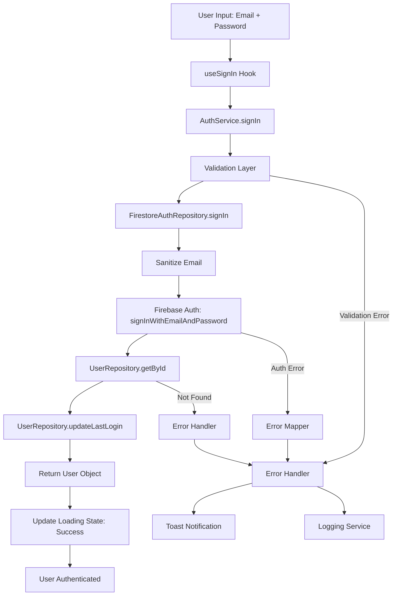
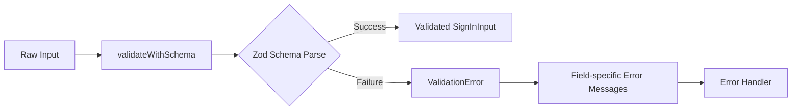
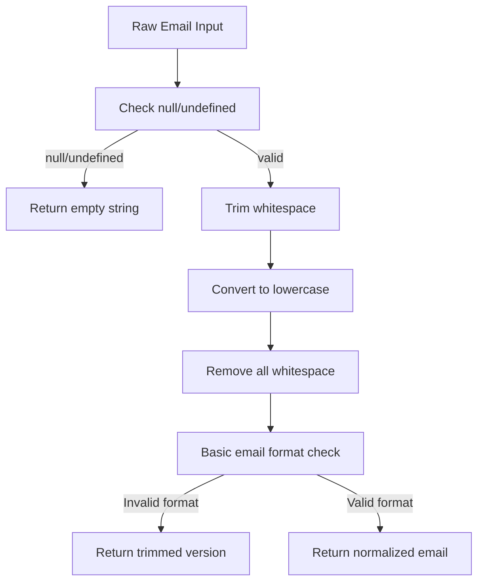
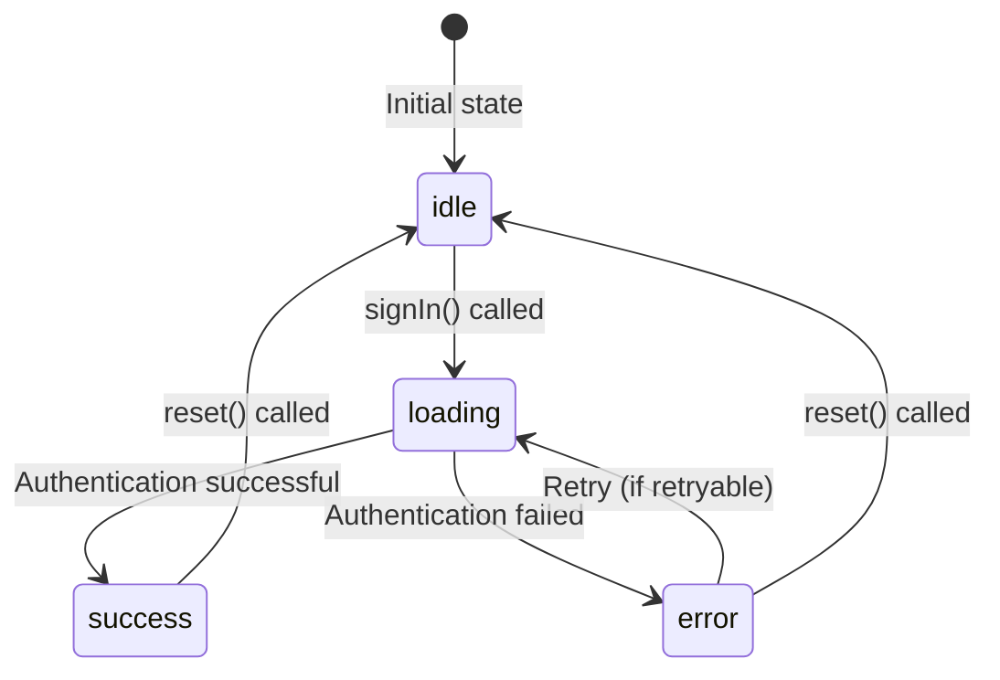
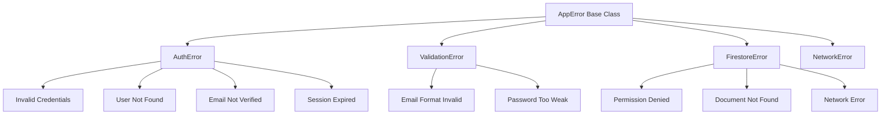
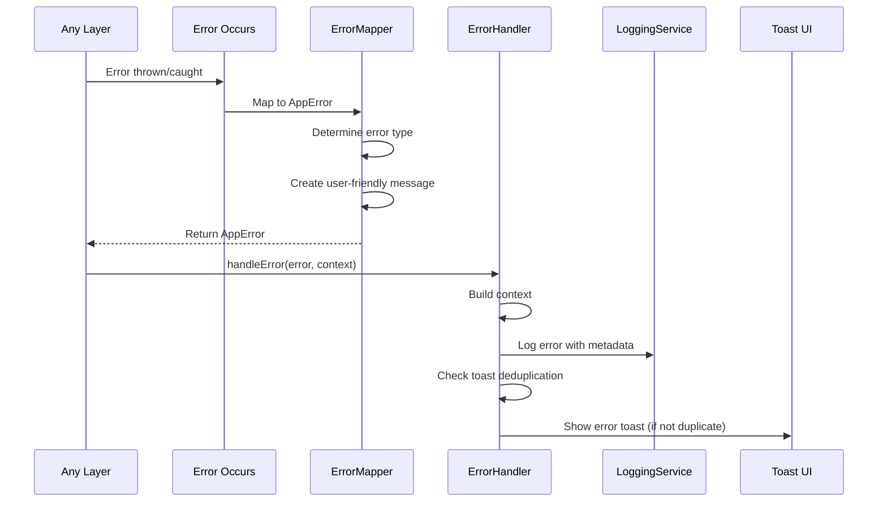
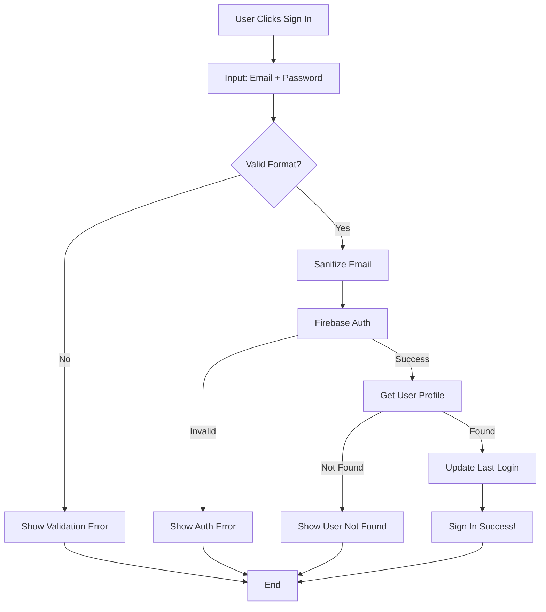

# Sign-In Flow Documentation

## Overview

This document traces the complete sign-in authentication flow in the Eye-Doo application, including all layers from user input to Firebase authentication and user profile retrieval.

---

## Table of Contents

1. [High-Level Flow](#high-level-flow)
2. [Detailed Sequence Diagram](#detailed-sequence-diagram)
3. [Data Structures](#data-structures)
4. [Input Validation](#input-validation)
5. [Sanitization Process](#sanitization-process)
6. [Loading States](#loading-states)
7. [Error Handling](#error-handling)
8. [File Structure & Function Calls](#file-structure--function-calls)
9. [Hooks Usage](#hooks-usage)
10. [Ports & Adapters](#ports--adapters)
11. [Simple Explanation](#simple-explanation)

---

## High-Level Flow



---

## Detailed Sequence Diagram


---

## Data Structures

### Input Data

```typescript
// SignInInput (from auth.schema.ts)
interface SignInInput {
  email: string;           // Validated: RFC-compliant email, max 254 chars
  password: string;       // Validated: min 8 chars, max 128, contains uppercase, lowercase, number
  rememberMe?: boolean;   // Optional, defaults to false
}
```

### Validated Data

```typescript
// After validation passes
SignInInput {
  email: string;      // Trimmed, lowercase, validated format
  password: string;   // Validated complexity rules
  rememberMe: boolean; // Default false if not provided
}
```

### Sanitized Data

```typescript
// Email after sanitization
sanitizedEmail: string;  // Trimmed, lowercase, spaces removed, basic format check
password: string;        // Only trimmed (spaces preserved intentionally)
```

### Return Data

```typescript
// User Object (from user.schema.ts)
interface User {
  id: string;
  name: {
    firstName: string;
    lastName: string;
  };
  displayName: string;
  email: string;
  preferences: UserPreferences;
  subscription: UserSubscription;
  setup: UserSetup;
  projects: UserProjects;
  role: UserRole;
  createdAt: Date;
  updatedAt?: Date;
  lastLoginAt?: Date;
  isEmailVerified?: boolean;
  // ... other fields
}
```

### Loading State

```typescript
// LoadingState<User> in useSignIn hook
type LoadingState<T> =
  | { status: 'idle' }
  | { status: 'loading'; data?: T; isOptimistic?: boolean }
  | { status: 'success'; data: T }
  | { status: 'error'; error: AppError; data?: T; isOptimistic?: boolean };
```

### Result Type

```typescript
// Result<T, E> pattern used throughout
type Result<T, E> =
  | { success: true; value: T }
  | { success: false; error: E };
```

---

## Input Validation

### Validation Schema

**File**: `src/domain/user/auth.schema.ts`

```typescript
export const signInInputSchema = z.object({
  email: emailSchema,                    // From shared-schemas.ts
  password: passwordSchema,              // From shared-schemas.ts
  rememberMe: z.boolean().optional().default(false),
});
```

### Email Schema Validation

**File**: `src/domain/common/shared-schemas.ts`

```typescript
export const emailSchema = z
  .string()
  .min(1, { message: 'Email address is required' })
  .max(254, { message: 'Email address is too long' })
  .email({ message: 'Please enter a valid email address' })
  .trim()
  .toLowerCase();
```

**Rules**:
- Required (min 1 character)
- Max 254 characters (RFC 5321)
- Valid email format (RFC-compliant)
- Automatically trimmed and lowercased

### Password Schema Validation

**File**: `src/domain/common/shared-schemas.ts`

```typescript
export const passwordSchema = z
  .string()
  .min(8, { message: 'Password must be at least 8 characters' })
  .max(128, { message: 'Password is too long' })
  .refine(val => /^(?=.*[a-z])(?=.*[A-Z])(?=.*\d)/.test(val), {
    message: 'Password must contain at least one uppercase, one lowercase, and one number',
  });
```

**Rules**:
- Minimum 8 characters
- Maximum 128 characters
- Must contain at least one uppercase letter
- Must contain at least one lowercase letter
- Must contain at least one digit

### Validation Flow



**Validation Function**: `validateWithSchema()` in `src/utils/validation-helpers.ts`

**Error Format**:
```typescript
ValidationError {
  code: ErrorCode.VALIDATION_ERROR,
  message: "Validation failed: ...",
  userMessage: "Please check your input and try again",
  fieldErrors: {
    "email": "Please enter a valid email address",
    "password": "Password must be at least 8 characters"
  },
  context: "AuthService.signIn",
  retryable: false
}
```

---

## Sanitization Process

### Email Sanitization

**File**: `src/utils/sanitization-helpers.ts`

**Function**: `sanitizeEmail(email: string | null | undefined): string`



**Process**:
1. **Null/Undefined Check**: Returns empty string if null or undefined
2. **Trim**: Removes leading/trailing whitespace
3. **Lowercase Conversion**: Converts to lowercase for consistency
4. **Whitespace Removal**: Removes all spaces from email
5. **Format Check**: Basic regex validation `/^[^\s@]+@[^\s@]+\.[^\s@]+$/`
6. **Return**: Normalized email or trimmed version if invalid

**Example**:
```
Input: "  JOHN.DOE@EXAMPLE.COM  "
Process: trim → lowercase → remove spaces → format check
Output: "john.doe@example.com"
```

**Location in Flow**: 
- Called in `FirestoreAuthRepository.signIn()` at line 168
- Before Firebase authentication

### Password Sanitization

**File**: `src/utils/sanitization-helpers.ts`

**Function**: `sanitizePassword(password: string | null | undefined): string`

**Note**: Passwords are intentionally NOT normalized to preserve intentional spaces. Only trimming is performed.

**Process**:
1. Check for null/undefined → return empty string
2. Convert to string
3. Trim leading/trailing whitespace only

**Location**: Not explicitly called in sign-in flow (Firebase handles password directly)

---

## Loading States

### State Transitions



### Loading State Management

**File**: `src/utils/loading-state.ts`

**State Creation**:
```typescript
// Initial state
const [state, setState] = useState<LoadingState<User>>({ status: 'idle' });

// Start loading
setState(loading());

// Success
setState(success(user));

// Error
setState(error(appError));
```

### Hook State Exposed

**File**: `src/hooks/use-auth.ts` (useSignIn)

**Returned Properties**:
```typescript
{
  state: LoadingState<User>,           // Full state object
  loading: boolean,                     // state.status === 'loading'
  error: AppError | null,               // Error if state is error
  user: User | null,                    // User if state is success
  signIn: (payload: SignInInput) => Promise<boolean>,
  reset: () => void                     // Reset to idle state
}
```

---

## Error Handling

### Error Types



### Error Flow



### Error Mapping

**File**: `src/utils/error-mapper.ts`

**Firebase Auth Errors**:
- `auth/invalid-email` → `AUTH_INVALID_CREDENTIALS`
- `auth/user-not-found` → `AUTH_USER_NOT_FOUND`
- `auth/wrong-password` → `AUTH_INVALID_CREDENTIALS`
- `auth/too-many-requests` → `AUTH_TOO_MANY_REQUESTS` (retryable)
- `auth/network-request-failed` → `NETWORK_CONNECTION_ERROR` (retryable)

**Error Handler**

**File**: `src/services/error-handler-service.ts`

**Process**:
1. **Log Error**: Structured logging with context metadata
2. **Deduplication**: Prevents duplicate toasts within 5 seconds
3. **Toast Display**: Shows user-friendly error message
4. **Retry Support**: Adds retry button for retryable errors

**Toast Configuration**:
```typescript
{
  title: 'Error',
  message: error.userMessage,      // User-friendly message
  type: 'error',
  action: error.retryable ? {
    label: 'Retry',
    onPress: retryAction
  } : undefined
}
```

---

## File Structure & Function Calls

### Complete Call Stack

```
UI Component
  └─> useSignIn().signIn(payload)
      ├─> setState(loading())
      └─> authService.signIn(payload)
          ├─> ErrorContextBuilder.fromService()
          └─> validateWithSchema(signInInputSchema, payload)
              └─> signInInputSchema.safeParse(payload)
                  └─> emailSchema.parse()
                  └─> passwordSchema.parse()
          
          └─> authRepository.signIn(validatedPayload)
              ├─> ErrorContextBuilder.fromRepository()
              ├─> sanitizeEmail(payload.email)
              │   ├─> sanitizeString()
              │   ├─> toLowerCase()
              │   └─> Basic email regex check
              │
              └─> signInWithEmailAndPassword(auth, email, password)
                  └─> Firebase Auth API
              
              └─> userRepository.getById(userId)
                  ├─> ErrorContextBuilder.fromRepository()
                  ├─> getDoc(doc(users, userId))
                  │   └─> Firestore API
                  └─> parseSnapshot(snapshot)
                      └─> validateWithSchema(userWrapperSchema, data)
              
              └─> userRepository.updateLastLogin(userId)
                  └─> updateDoc(doc, { lastLoginAt, updatedAt })
                      └─> Firestore API
```

### Files Involved

| File | Purpose | Key Functions |
|------|---------|---------------|
| `src/hooks/use-auth.ts` | React hook for sign-in | `useSignIn()` |
| `src/services/auth-service.ts` | Business logic orchestration | `signIn()` |
| `src/repositories/firestore/firestore-auth-repository.ts` | Firebase Auth adapter | `signIn()` |
| `src/repositories/firestore/firestore-user-repository.ts` | Firestore user data adapter | `getById()`, `updateLastLogin()` |
| `src/domain/user/auth.schema.ts` | Input validation schemas | `signInInputSchema` |
| `src/domain/common/shared-schemas.ts` | Shared validation schemas | `emailSchema`, `passwordSchema` |
| `src/utils/validation-helpers.ts` | Validation utilities | `validateWithSchema()` |
| `src/utils/sanitization-helpers.ts` | Input sanitization | `sanitizeEmail()` |
| `src/utils/error-mapper.ts` | Error type mapping | `fromFirebaseAuth()`, `userNotFound()` |
| `src/services/error-handler-service.ts` | Centralized error handling | `handle()` |
| `src/services/logging-service.ts` | Error logging | `error()` |
| `src/utils/loading-state.ts` | Loading state management | `loading()`, `success()`, `error()` |
| `src/utils/error-context-builder.ts` | Error context creation | `fromService()`, `fromRepository()` |

---

## Hooks Usage

### useSignIn Hook

**File**: `src/hooks/use-auth.ts`

**Usage Pattern**:
```typescript
const { signIn, loading, error, user, reset } = useSignIn();

// In component
const handleSignIn = async () => {
  const success = await signIn({
    email: emailInput,
    password: passwordInput,
    rememberMe: false
  });
  
  if (success) {
    // Navigation or success handling
  }
};
```

**State Management**:
- Uses `useState<LoadingState<User>>` for state management
- Uses `useRef` for mounting check (prevents state updates after unmount)
- Uses `useCallback` for memoized function creation
- Uses `useErrorHandler` hook for error handling

**Lifecycle**:
```typescript
// Component mount
useEffect(() => {
  return () => {
    isMountedRef.current = false;  // Cleanup on unmount
  };
}, []);

// Sign-in function
const signIn = useCallback(async (payload: SignInInput) => {
  setState(loading());                    // 1. Set loading
  const result = await authService.signIn(payload);  // 2. Call service
  
  if (!isMountedRef.current) return false;  // 3. Check mounted
  
  if (result.success) {
    setState(success(result.value));       // 4a. Set success
    return true;
  } else {
    setState(error(result.error));          // 4b. Set error
    handleError(result.error, {...});      // 5. Handle error
    return false;
  }
}, [handleError]);
```

### useErrorHandler Hook

**File**: `src/hooks/use-error-handler.ts`

**Purpose**: Provides consistent error handling across hooks

**Usage**:
```typescript
const { handleError } = useErrorHandler();

handleError(error, {
  component: 'useSignIn',
  method: 'signIn'
});
```

**Implementation**:
- Wraps `AppErrorHandler.handle()` with React `useCallback`
- Ensures consistent error handling pattern

---

## Ports & Adapters

### Architecture Pattern

The application uses **Ports & Adapters (Hexagonal Architecture)**:

- **Ports**: Interfaces defining contracts (`IAuthRepository`, `IUserRepository`)
- **Adapters**: Concrete implementations (`FirestoreAuthRepository`, `FirestoreUserRepository`)

### Ports (Interfaces)

#### IAuthRepository

**File**: `src/repositories/i-auth-repository.ts`

**Contract**:
```typescript
interface IAuthRepository {
  signIn(payload: SignInInput): Promise<Result<User, AppError>>;
  // ... other methods
}
```

**Purpose**: Defines the contract for authentication operations

#### IUserRepository

**File**: `src/repositories/i-user-repository.ts`

**Contract**:
```typescript
interface IUserRepository {
  getById(userId: string): Promise<Result<User, AppError>>;
  updateLastLogin(userId: string): Promise<Result<void, AppError>>;
  // ... other methods
}
```

**Purpose**: Defines the contract for user data operations

### Adapters (Implementations)

#### FirestoreAuthRepository

**File**: `src/repositories/firestore/firestore-auth-repository.ts`

**Implements**: `IAuthRepository`

**Responsibilities**:
- Firebase Auth operations
- Email sanitization
- Error mapping from Firebase Auth errors
- Delegation to UserRepository for user data

**Dependencies**: 
- Firebase Auth SDK
- IUserRepository (injected via constructor)

#### FirestoreUserRepository

**File**: `src/repositories/firestore/firestore-user-repository.ts`

**Implements**: `IUserRepository`

**Responsibilities**:
- Firestore document operations
- User document parsing and validation
- Timestamp management

**Dependencies**:
- Firestore SDK
- User schema validation

### Dependency Injection

**File**: `src/services/ServiceFactory.ts`

**Pattern**: Service Factory creates services with injected repositories

```typescript
export class AuthService {
  constructor(
    private authRepo: IAuthRepository,      // Port (interface)
    private userRepo: IUserRepository      // Port (interface)
  ) {}
}
```

**Factory Setup**:
```typescript
const authRepository = new FirestoreAuthRepository(
  new FirestoreUserRepository()  // Adapter implementation
);

const authService = new AuthService(
  authRepository,    // Adapter implementing IAuthRepository
  userRepository    // Adapter implementing IUserRepository
);
```

---

## Simple Explanation

### What Happens When You Sign In?

Imagine signing in is like entering a secured building:

#### Step 1: You Give Your ID
- You provide your email (like showing your ID card)
- You provide your password (like providing your key)

#### Step 2: Front Desk Checks Your ID Format
- **Validation**: The system checks if your email looks valid (has @ symbol, proper format)
- **Validation**: Checks if your password meets requirements (long enough, has letters and numbers)
- If either is wrong → **Error**: "Please check your email/password format"

#### Step 3: ID Card Cleaning
- **Sanitization**: Your email is cleaned up (lowercased, spaces removed)
- Example: "  JOHN@EMAIL.COM  " becomes "john@email.com"

#### Step 4: Security Check at Main Entrance
- **Firebase Authentication**: Your cleaned email and password are checked against the security database
- If wrong → **Error**: "Invalid email or password"
- If correct → You get a security badge (Firebase user credential)

#### Step 5: Get Your Profile
- **User Repository**: Using your security badge ID, the system looks up your full profile in the user database
- This includes your name, preferences, subscription, etc.
- If profile not found → **Error**: "User profile not found"

#### Step 6: Update Your Last Visit
- **Last Login Update**: The system notes that you just logged in (updates `lastLoginAt`)
- This happens in the background and won't block your login if it fails

#### Step 7: Welcome!
- **Success**: All done! Your profile is loaded and you're signed in
- The UI updates to show you're logged in

### Error Handling

If anything goes wrong at any step:

1. **Error is Caught**: The system catches the error
2. **Error is Classified**: Determines what type of error (validation, auth, network, etc.)
3. **User-Friendly Message**: Converts technical error to a message you understand
4. **Error is Logged**: Technical details are logged for developers
5. **You See a Toast**: A notification appears telling you what went wrong
6. **Retry Option**: If it's a temporary error (like network issue), you can retry

### Loading States

Throughout the process, the UI shows different states:

- **Idle**: Nothing happening (initial state)
- **Loading**: Sign-in in progress (spinner/loading indicator)
- **Success**: Sign-in complete (user authenticated)
- **Error**: Something went wrong (error message shown)

### Why This Architecture?

The code is organized in layers:

- **Hooks** (UI Layer): React components use hooks to interact with services
- **Services** (Business Logic): Orchestrate the flow, validate business rules
- **Repositories** (Data Access): Handle actual database/API calls
- **Ports & Adapters**: Allow swapping implementations (e.g., testing with mock repositories)

This makes the code:
- **Testable**: Easy to test each layer independently
- **Maintainable**: Changes in one layer don't break others
- **Flexible**: Can swap Firebase for another auth provider easily

---

## Summary Flow Chart



---

## Key Takeaways

1. **Validation First**: All inputs are validated before processing
2. **Sanitization**: Email is sanitized before Firebase Auth
3. **Error Handling**: Comprehensive error handling at every layer
4. **Loading States**: Clear loading state management for UI feedback
5. **Clean Architecture**: Separated concerns with Ports & Adapters
6. **Type Safety**: Strong TypeScript types throughout
7. **User Experience**: User-friendly error messages with retry options
8. **Security**: Password complexity requirements, proper error messages that don't leak info

---

*Document generated: 2025-01-XX*
*Last updated: Based on current codebase structure*

