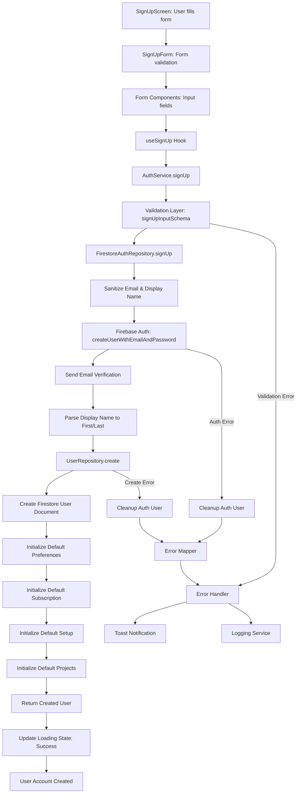
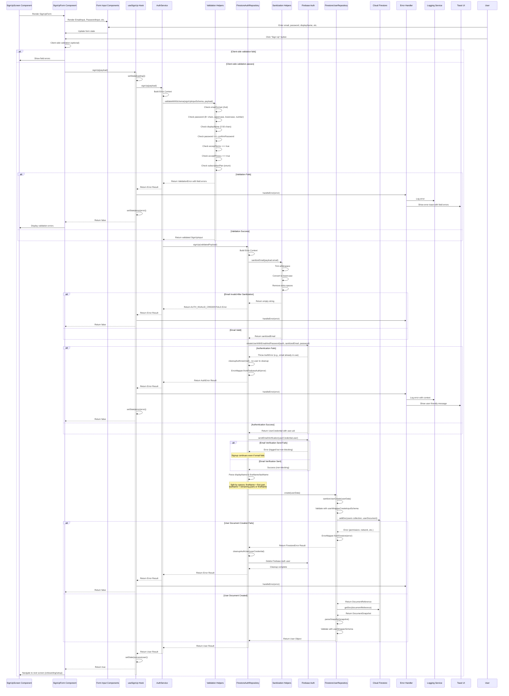
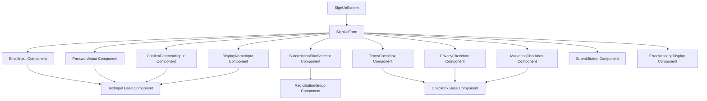
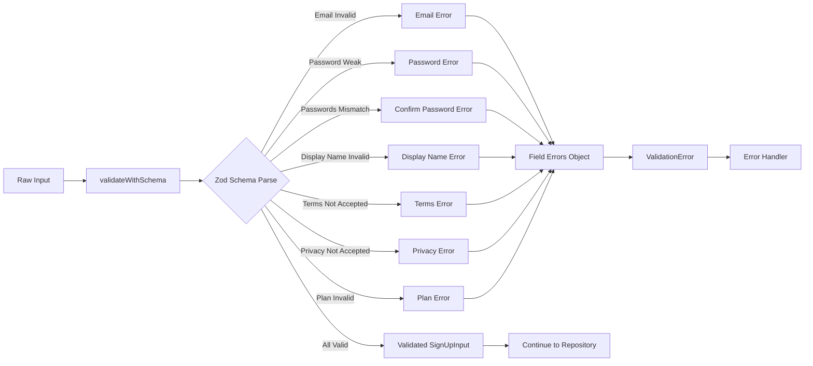
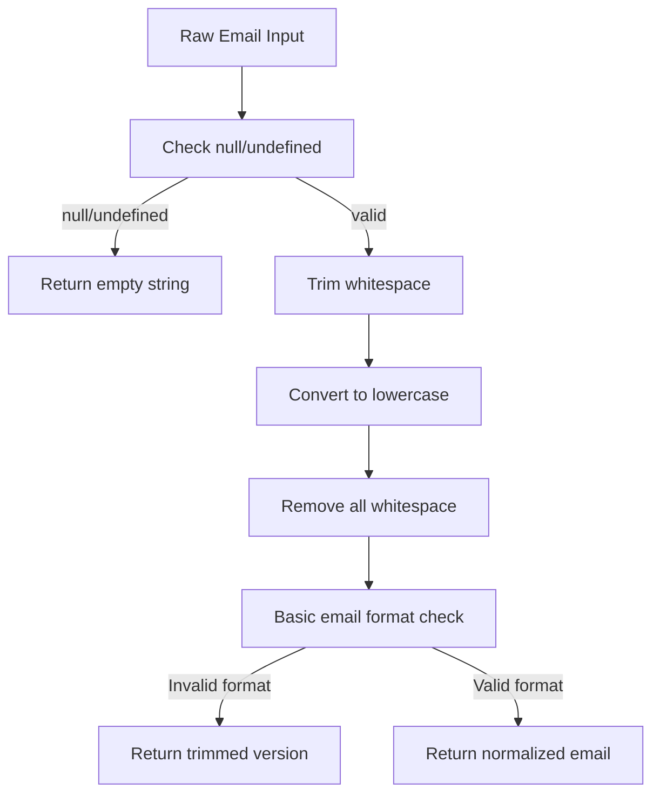
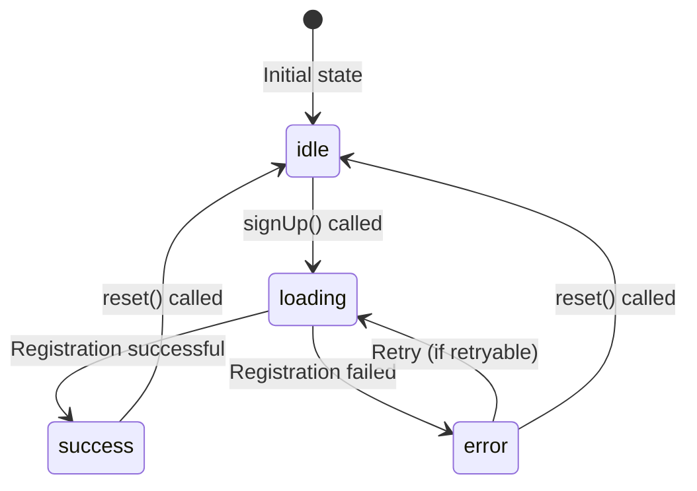
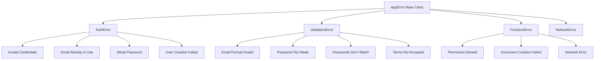
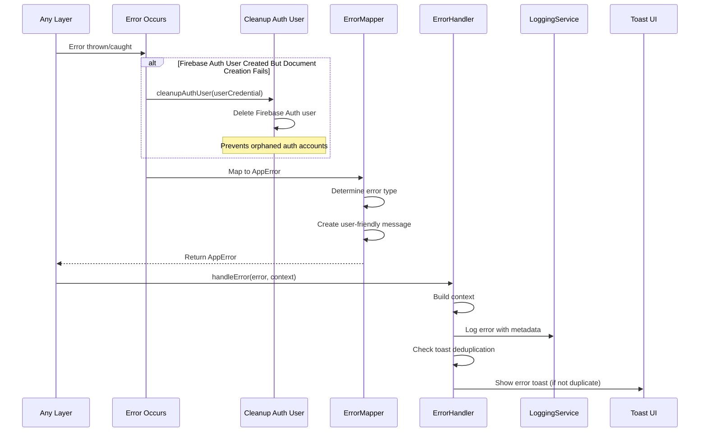
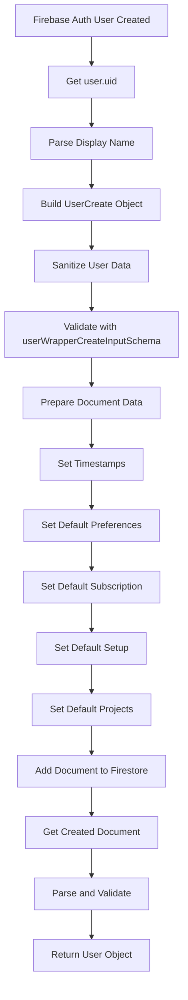
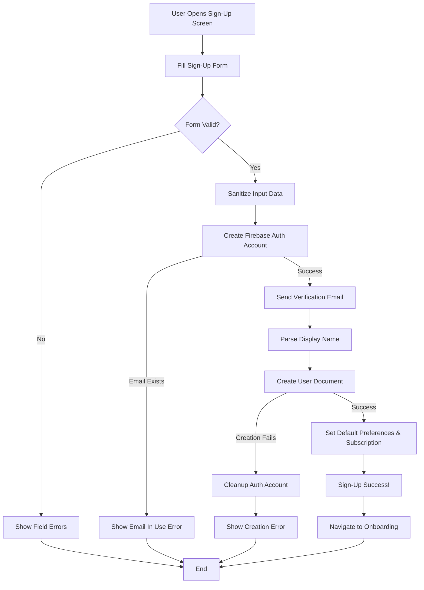

# Sign-Up Flow Documentation

## Overview

This document traces the complete sign-up (registration) authentication flow in the Eye-Doo application, including all layers from user input through Firebase authentication, user profile creation, and email verification setup.

---

## Table of Contents

1. [High-Level Flow](#high-level-flow)
2. [Detailed Sequence Diagram](#detailed-sequence-diagram)
3. [UI Component Structure](#ui-component-structure)
4. [Data Structures](#data-structures)
5. [Input Validation](#input-validation)
6. [Sanitization Process](#sanitization-process)
7. [Loading States](#loading-states)
8. [Error Handling](#error-handling)
9. [User Creation Process](#user-creation-process)
10. [File Structure & Function Calls](#file-structure--function-calls)
11. [Hooks Usage](#hooks-usage)
12. [Ports & Adapters](#ports--adapters)
13. [Simple Explanation](#simple-explanation)

---

## High-Level Flow



---

## Detailed Sequence Diagram



---

## UI Component Structure

### Component Hierarchy



### Placeholder Components

#### SignUpScreen Component

**Location**: `src/app/(auth)/signup.tsx` (placeholder)

**Responsibilities**:
- Container for sign-up form
- Navigation setup
- Error boundary wrapping
- Layout and styling

**Props**:
```typescript
interface SignUpScreenProps {
  navigation: NavigationProp;
}
```

#### SignUpForm Component

**Location**: `src/components/auth/SignUpForm.tsx` (placeholder)

**Responsibilities**:
- Form state management
- Field validation coordination
- Submission handling
- Error display coordination

**Props**:
```typescript
interface SignUpFormProps {
  onSubmit?: (data: SignUpInput) => void;
  isLoading?: boolean;
  error?: AppError | null;
}
```

**State**:
```typescript
{
  email: string;
  password: string;
  confirmPassword: string;
  displayName: string;
  subscriptionPlan: SubscriptionPlan;
  acceptTerms: boolean;
  acceptPrivacy: boolean;
  acceptMarketing: boolean;
  fieldErrors: Record<string, string>;
}
```

#### Form Input Components

**EmailInput Component** (`src/components/forms/EmailInput.tsx` - placeholder)
- Validates email format on blur
- Shows validation errors
- Sanitizes input (trim, lowercase)

**PasswordInput Component** (`src/components/forms/PasswordInput.tsx` - placeholder)
- Password strength indicator
- Show/hide password toggle
- Validates complexity requirements

**ConfirmPasswordInput Component** (`src/components/forms/ConfirmPasswordInput.tsx` - placeholder)
- Compares with password field
- Shows match/mismatch indicator

**DisplayNameInput Component** (`src/components/forms/DisplayNameInput.tsx` - placeholder)
- Character count display
- Length validation feedback

**SubscriptionPlanSelector Component** (`src/components/forms/SubscriptionPlanSelector.tsx` - placeholder)
- Radio button group or selector
- Shows plan features
- Price display

**TermsCheckbox Component** (`src/components/forms/TermsCheckbox.tsx` - placeholder)
- Links to terms and conditions
- Required validation

**PrivacyCheckbox Component** (`src/components/forms/PrivacyCheckbox.tsx` - placeholder)
- Links to privacy policy
- Required validation

**MarketingCheckbox Component** (`src/components/forms/MarketingCheckbox.tsx` - placeholder)
- Optional consent
- Opt-in/opt-out toggle

---

## Data Structures

### Input Data

```typescript
// SignUpInput (from auth.schema.ts)
interface SignUpInput {
  email: string;                    // Validated: RFC-compliant email, max 254 chars
  password: string;                  // Validated: min 8 chars, max 128, contains uppercase, lowercase, number
  displayName: string;              // Validated: min 2 chars, max 50 chars, trimmed
  confirmPassword: string;           // Validated: must match password
  subscriptionPlan: SubscriptionPlan; // Validated: FREE | PRO | STUDIO (enum)
  acceptTerms: boolean;             // Validated: must be true
  acceptPrivacy: boolean;           // Validated: must be true
  acceptMarketing?: boolean;        // Optional: defaults to false
}
```

### SubscriptionPlan Enum

```typescript
// From constants/enums.ts
enum SubscriptionPlan {
  FREE = 'free',
  PRO = 'pro',
  STUDIO = 'studio',
}
```

### Validated Data

```typescript
// After validation passes
SignUpInput {
  email: string;                    // Trimmed, lowercase, validated format
  password: string;                  // Validated complexity rules
  displayName: string;              // Trimmed, 2-50 chars
  confirmPassword: string;           // Matches password
  subscriptionPlan: SubscriptionPlan;     // Valid enum value
  acceptTerms: true;                 // Must be true
  acceptPrivacy: true;               // Must be true
  acceptMarketing: boolean;          // Optional, defaults to false
}
```

### Sanitized Data

```typescript
// Email after sanitization
sanitizedEmail: string;             // Trimmed, lowercase, spaces removed, basic format check

// Display name parsing
firstName: string;                   // First word from displayName
lastName: string;                    // Remaining words or firstName if only one word
displayName: string;                 // Trimmed display name
```

### User Creation Data

```typescript
// UserCreate (passed to UserRepository.create)
interface UserCreate {
  id: string;                        // Firebase Auth user.uid
  name: {
    firstName: string;               // Parsed from displayName
    lastName: string;                // Parsed from displayName
  };
  displayName: string;               // User's full display name
  email: string;                     // Sanitized email
  preferences: UserPreferences;      // Default + marketing consent
  subscription: UserSubscription;    // Default + selected plan + start date
  setup: UserSetup;                  // Default setup flags
  projects: UserProjects;            // Default empty projects
  role: UserRole;                    // USER (default)
}
```

### Default User Preferences

```typescript
// From user.schema.ts
defaultUserPreferences: {
  id: '',                            // Will be set to userId
  userId: '',                        // Will be set to userId
  notifications: true,
  darkMode: false,
  language: LanguageOption.ENGLISH,
  weatherUnits: WeatherUnit.METRIC,
  weekStartsOn: 1,
  marketingConsent: false,           // Set from payload.acceptMarketing
  timezone: 'UTC',
  dateFormat: 'DD/MM/YYYY',
  timeFormat: '24h',
}
```

### Default User Subscription

```typescript
// From user.schema.ts
defaultUserSubscription: {
  id: '',                            // Will be set to userId
  plan: SubscriptionPlan.PRO,        // Overridden by payload.subscriptionPlan
  isActive: true,
  autoRenew: true,
  startDate: new Date(),             // Set to current date
  endDate: undefined,
  canceledAt: undefined,
  trialEndsAt: undefined,
  billingCycle: PaymentInterval.MONTHLY,
}
```

### Default User Setup

```typescript
// From user.schema.ts
defaultUserSetup: {
  firstTimeSetup: true,
  showOnboarding: true,
  customKitListSetup: false,
  customTaskListSetup: false,
  customBusinessCardSetup: false,
  customGroupShotsSetup: false,
  customCoupleShotsSetup: false,
  onboardingCompletedDate: undefined,
}
```

### Default User Projects

```typescript
// From user.schema.ts
defaultUserProjects: {
  activeProjects: 0,
  totalProjects: 0,
  projects: [],
}
```

### Return Data

```typescript
// User Object (from user.schema.ts)
interface User {
  id: string;
  name: {
    firstName: string;
    lastName: string;
  };
  displayName: string;
  email: string;
  preferences: UserPreferences;
  subscription: UserSubscription;
  setup: UserSetup;
  projects: UserProjects;
  role: UserRole;
  createdAt: Date;
  updatedAt?: Date;
  isEmailVerified: boolean;
  isActive: boolean;
  // ... other fields
}
```

### Loading State

```typescript
// LoadingState<User> in useSignUp hook
type LoadingState<T> =
  | { status: 'idle' }
  | { status: 'loading'; data?: T; isOptimistic?: boolean }
  | { status: 'success'; data: T }
  | { status: 'error'; error: AppError; data?: T; isOptimistic?: boolean };
```

---

## Input Validation

### Validation Schema

**File**: `src/domain/user/auth.schema.ts`

```typescript
export const signUpInputSchema = z
  .object({
    email: emailSchema,                    // From shared-schemas.ts
    password: passwordSchema,                // From shared-schemas.ts
    displayName: displayNameSchema,          // From shared-schemas.ts
    confirmPassword: passwordSchema,
    subscriptionPlan: z.nativeEnum(SubscriptionPlan),
    acceptTerms: z.boolean().refine(val => val === true, {
      message: 'You must accept the terms and conditions',
    }),
    acceptPrivacy: z.boolean().refine(val => val === true, {
      message: 'You must accept the privacy policy',
    }),
    acceptMarketing: z.boolean().optional(),
  })
  .refine(data => data.password === data.confirmPassword, {
    message: "Passwords don't match",
    path: ['confirmPassword'],
  });
```

### Email Schema Validation

**File**: `src/domain/common/shared-schemas.ts`

```typescript
export const emailSchema = z
  .string()
  .min(1, { message: 'Email address is required' })
  .max(254, { message: 'Email address is too long' })
  .email({ message: 'Please enter a valid email address' })
  .trim()
  .toLowerCase();
```

**Rules**:
- Required (min 1 character)
- Max 254 characters (RFC 5321)
- Valid email format (RFC-compliant)
- Automatically trimmed and lowercased

### Password Schema Validation

**File**: `src/domain/common/shared-schemas.ts`

```typescript
export const passwordSchema = z
  .string()
  .min(8, { message: 'Password must be at least 8 characters' })
  .max(128, { message: 'Password is too long' })
  .refine(val => /^(?=.*[a-z])(?=.*[A-Z])(?=.*\d)/.test(val), {
    message: 'Password must contain at least one uppercase, one lowercase, and one number',
  });
```

**Rules**:
- Minimum 8 characters
- Maximum 128 characters
- Must contain at least one uppercase letter
- Must contain at least one lowercase letter
- Must contain at least one digit

### Display Name Schema Validation

**File**: `src/domain/common/shared-schemas.ts`

```typescript
export const displayNameSchema = z
  .string()
  .min(2, { message: 'Display name must be at least 2 characters' })
  .max(50, { message: 'Display name must be less than 50 characters' })
  .trim();
```

**Rules**:
- Minimum 2 characters
- Maximum 50 characters
- Automatically trimmed

### Password Match Validation

```typescript
.refine(data => data.password === data.confirmPassword, {
  message: "Passwords don't match",
  path: ['confirmPassword'],
})
```

**Rules**:
- `password` and `confirmPassword` must be identical
- Error is attached to `confirmPassword` field

### Terms & Privacy Validation

```typescript
acceptTerms: z.boolean().refine(val => val === true, {
  message: 'You must accept the terms and conditions',
}),
acceptPrivacy: z.boolean().refine(val => val === true, {
  message: 'You must accept the privacy policy',
}),
```

**Rules**:
- Both must be `true`
- Cannot proceed without accepting both

### Subscription Plan Validation

```typescript
subscriptionPlan: z.nativeEnum(SubscriptionPlan),
```

**Rules**:
- Must be one of: `FREE`, `PRO`, `STUDIO`
- Type-safe enum validation

### Validation Flow



**Validation Function**: `validateWithSchema()` in `src/utils/validation-helpers.ts`

**Error Format**:
```typescript
ValidationError {
  code: ErrorCode.VALIDATION_ERROR,
  message: "Validation failed: ...",
  userMessage: "Please check your input and try again",
  fieldErrors: {
    "email": "Please enter a valid email address",
    "password": "Password must be at least 8 characters",
    "confirmPassword": "Passwords don't match",
    "displayName": "Display name must be at least 2 characters",
    "acceptTerms": "You must accept the terms and conditions",
    "acceptPrivacy": "You must accept the privacy policy"
  },
  context: "AuthService.signUp",
  retryable: false
}
```

---

## Sanitization Process

### Email Sanitization

**File**: `src/utils/sanitization-helpers.ts`

**Function**: `sanitizeEmail(email: string | null | undefined): string`



**Process**:
1. **Null/Undefined Check**: Returns empty string if null or undefined
2. **Trim**: Removes leading/trailing whitespace
3. **Lowercase Conversion**: Converts to lowercase for consistency
4. **Whitespace Removal**: Removes all spaces from email
5. **Format Check**: Basic regex validation `/^[^\s@]+@[^\s@]+\.[^\s@]+$/`
6. **Return**: Normalized email or trimmed version if invalid

**Location in Flow**: 
- Called in `FirestoreAuthRepository.signUp()` at line 95
- Before Firebase authentication

### Display Name Sanitization

**File**: `src/repositories/firestore/firestore-user-repository.ts`

**Function**: `sanitizeUserCreate()` calls `sanitizeString()`

**Process**:
1. Trim whitespace from display name
2. Split display name by spaces to extract firstName and lastName
3. firstName = first word or empty string
4. lastName = remaining words joined by space, or firstName if only one word

**Example**:
```
Input: "  John Michael Doe  "
Process:
  - Trim: "John Michael Doe"
  - Split: ["John", "Michael", "Doe"]
  - firstName: "John"
  - lastName: "Michael Doe"
```

**Location in Flow**:
- Called in `FirestoreAuthRepository.signUp()` at line 119-121
- Before creating user document

### User Create Sanitization

**File**: `src/repositories/firestore/firestore-user-repository.ts`

**Function**: `sanitizeUserCreate(payload: UserCreate): UserCreate`

**Process**:
```typescript
{
  ...payload,
  displayName: sanitizeString(payload.displayName),
  email: sanitizeEmail(payload.email),
  phone: payload.phone ? sanitizePhone(payload.phone) : payload.phone,
  name: {
    firstName: sanitizeString(payload.name.firstName),
    lastName: sanitizeString(payload.name.lastName),
  },
  bannedReason: payload.bannedReason ? sanitizeString(payload.bannedReason) : payload.bannedReason,
}
```

**Sanitizes**:
- Display name (trim)
- Email (trim, lowercase, remove spaces)
- Phone (if provided: remove non-digits except leading +)
- First name (trim)
- Last name (trim)
- Banned reason (trim, if provided)

---

## Loading States

### State Transitions



### Loading State Management

**File**: `src/utils/loading-state.ts`

**State Creation**:
```typescript
// Initial state
const [state, setState] = useState<LoadingState<User>>({ status: 'idle' });

// Start loading
setState(loading());

// Success
setState(success(user));

// Error
setState(error(appError));
```

### Hook State Exposed

**File**: `src/hooks/use-auth.ts` (useSignUp)

**Returned Properties**:
```typescript
{
  state: LoadingState<User>,           // Full state object
  loading: boolean,                     // state.status === 'loading'
  error: AppError | null,               // Error if state is error
  user: User | null,                    // User if state is success
  signUp: (payload: SignUpInput) => Promise<boolean>,
  reset: () => void                     // Reset to idle state
}
```

---

## Error Handling

### Error Types



### Error Flow



### Error Mapping

**File**: `src/utils/error-mapper.ts`

**Firebase Auth Errors**:
- `auth/email-already-in-use` → `AUTH_EMAIL_IN_USE`
- `auth/invalid-email` → `AUTH_INVALID_CREDENTIALS`
- `auth/weak-password` → `AUTH_WEAK_PASSWORD`
- `auth/operation-not-allowed` → `AUTH_OPERATION_NOT_ALLOWED`
- `auth/network-request-failed` → `NETWORK_CONNECTION_ERROR` (retryable)

**Firestore Errors**:
- `permission-denied` → `DB_PERMISSION_DENIED`
- `unavailable` → `DB_NETWORK_ERROR` (retryable)

**Cleanup Process**:

**File**: `src/repositories/firestore/firestore-auth-repository.ts`

**Function**: `cleanupAuthUser(userCredential, context)`

**Purpose**: If Firebase Auth user is created but Firestore document creation fails, delete the auth user to prevent orphaned accounts.

**Process**:
1. Check if userCredential exists
2. Call `userCredential.user.delete()`
3. Log cleanup errors but don't fail the operation
4. Return success even if cleanup fails (non-blocking)

---

## User Creation Process

### Step-by-Step User Document Creation



### User Document Structure

```typescript
{
  // Identity
  id: string,                          // Firebase Auth user.uid
  name: {
    firstName: string,                  // Parsed from displayName
    lastName: string,                   // Parsed from displayName
  },
  displayName: string,                 // Original display name
  email: string,                       // Sanitized email
  role: UserRole.USER,                 // Default role
  
  // Status Flags
  isEmailVerified: false,              // Will be true after email verification
  isActive: true,                       // Account is active
  isBanned: false,                      // Not banned
  bannedAt: null,
  bannedReason: null,
  deletedAt: null,
  
  // Preferences (default + custom)
  preferences: {
    id: userId,
    userId: userId,
    notifications: true,
    darkMode: false,
    language: LanguageOption.ENGLISH,
    weatherUnits: WeatherUnit.METRIC,
    weekStartsOn: 1,
    marketingConsent: boolean,          // From payload.acceptMarketing
    timezone: 'UTC',
    dateFormat: 'DD/MM/YYYY',
    timeFormat: '24h',
  },
  
  // Subscription (default + selected plan)
  subscription: {
    id: userId,
    plan: SubscriptionPlan,             // From payload.subscriptionPlan
    isActive: true,
    autoRenew: true,
    startDate: Date,                     // Current date
    endDate: undefined,
    canceledAt: undefined,
    trialEndsAt: undefined,
    billingCycle: PaymentInterval.MONTHLY,
  },
  
  // Setup (all defaults)
  setup: {
    firstTimeSetup: true,
    showOnboarding: true,
    customKitListSetup: false,
    customTaskListSetup: false,
    customBusinessCardSetup: false,
    customGroupShotsSetup: false,
    customCoupleShotsSetup: false,
    onboardingCompletedDate: undefined,
  },
  
  // Projects (empty)
  projects: {
    activeProjects: 0,
    totalProjects: 0,
    projects: [],
  },
  
  // Timestamps
  createdAt: Timestamp,                 // Server timestamp
  updatedAt: Timestamp,                 // Server timestamp
  lastLoginAt: null,                    // Will be set on first login
  
  // Metadata
  metadata: null,                        // Empty for new users
}
```

### Name Parsing Logic

**File**: `src/repositories/firestore/firestore-auth-repository.ts`

```typescript
// Extract firstName and lastName from displayName
const nameParts = payload.displayName.trim().split(/\s+/);
const firstName = nameParts[0] || '';
const lastName = nameParts.slice(1).join(' ') || firstName;
```

**Examples**:
- `"John Doe"` → firstName: `"John"`, lastName: `"Doe"`
- `"John"` → firstName: `"John"`, lastName: `"John"` (fallback)
- `"John Michael Doe"` → firstName: `"John"`, lastName: `"Michael Doe"`
- `"  John  Doe  "` → firstName: `"John"`, lastName: `"Doe"` (trimmed)

---

## File Structure & Function Calls

### Complete Call Stack

```
UI Component (SignUpScreen - placeholder)
  └─> SignUpForm Component (placeholder)
      └─> useSignUp().signUp(payload)
          ├─> setState(loading())
          └─> authService.signUp(payload)
              ├─> ErrorContextBuilder.fromService()
              └─> validateWithSchema(signUpInputSchema, payload)
                  └─> signUpInputSchema.safeParse(payload)
                      ├─> emailSchema.parse()
                      ├─> passwordSchema.parse()
                      ├─> displayNameSchema.parse()
                      ├─> confirmPassword validation
                      ├─> acceptTerms refinement
                      ├─> acceptPrivacy refinement
                      └─> subscriptionPlan enum validation
              
              └─> authRepository.signUp(validatedPayload)
                  ├─> ErrorContextBuilder.fromRepository()
                  ├─> sanitizeEmail(payload.email)
                  │   ├─> sanitizeString()
                  │   ├─> toLowerCase()
                  │   └─> Basic email regex check
                  │
                  └─> createUserWithEmailAndPassword(auth, email, password)
                      └─> Firebase Auth API
                  
                  └─> sendEmailVerification(userCredential.user)
                      └─> Firebase Auth API (non-blocking)
                  
                  └─> Parse displayName to firstName/lastName
                      └─> Split and join logic
                  
                  └─> userRepository.create(userData)
                      ├─> ErrorContextBuilder.fromRepository()
                      ├─> sanitizeUserCreate(userData)
                      │   ├─> sanitizeString(displayName)
                      │   ├─> sanitizeEmail(email)
                      │   ├─> sanitizeString(firstName)
                      │   └─> sanitizeString(lastName)
                      │
                      ├─> validateWithSchema(userWrapperCreateInputSchema, sanitized)
                      │   └─> userWrapperCreateInputSchema.safeParse()
                      │
                      └─> addDoc(users collection, userDocument)
                          └─> Firestore API
                      
                      └─> getDoc(documentReference)
                          └─> Firestore API
                      
                      └─> parseSnapshot(snapshot)
                          └─> validateWithSchema(userWrapperSchema, data)
                  
                  └─> cleanupAuthUser(userCredential) [on error only]
                      └─> userCredential.user.delete()
                          └─> Firebase Auth API
```

### Files Involved

| File | Purpose | Key Functions |
|------|---------|---------------|
| `src/app/(auth)/signup.tsx` | Sign-up screen (placeholder) | Screen component |
| `src/components/auth/SignUpForm.tsx` | Sign-up form (placeholder) | Form component |
| `src/components/forms/*.tsx` | Form input components (placeholders) | Input components |
| `src/hooks/use-auth.ts` | React hook for sign-up | `useSignUp()` |
| `src/services/auth-service.ts` | Business logic orchestration | `signUp()` |
| `src/repositories/firestore/firestore-auth-repository.ts` | Firebase Auth adapter | `signUp()`, `cleanupAuthUser()` |
| `src/repositories/firestore/firestore-user-repository.ts` | Firestore user data adapter | `create()`, `sanitizeUserCreate()` |
| `src/domain/user/auth.schema.ts` | Input validation schemas | `signUpInputSchema` |
| `src/domain/common/shared-schemas.ts` | Shared validation schemas | `emailSchema`, `passwordSchema`, `displayNameSchema` |
| `src/utils/validation-helpers.ts` | Validation utilities | `validateWithSchema()` |
| `src/utils/sanitization-helpers.ts` | Input sanitization | `sanitizeEmail()`, `sanitizeString()` |
| `src/utils/error-mapper.ts` | Error type mapping | `fromFirebaseAuth()`, `fromFirestore()` |
| `src/services/error-handler-service.ts` | Centralized error handling | `handle()` |
| `src/services/logging-service.ts` | Error logging | `error()` |
| `src/utils/loading-state.ts` | Loading state management | `loading()`, `success()`, `error()` |
| `src/utils/error-context-builder.ts` | Error context creation | `fromService()`, `fromRepository()` |
| `src/domain/user/user.schema.ts` | User domain schemas | Default values, user schemas |

---

## Hooks Usage

### useSignUp Hook

**File**: `src/hooks/use-auth.ts`

**Usage Pattern**:
```typescript
const { signUp, loading, error, user, reset } = useSignUp();

// In component
const handleSignUp = async (formData: SignUpFormData) => {
  const success = await signUp({
    email: formData.email,
    password: formData.password,
    displayName: formData.displayName,
    confirmPassword: formData.confirmPassword,
    subscriptionPlan: formData.subscriptionPlan,
    acceptTerms: formData.acceptTerms,
    acceptPrivacy: formData.acceptPrivacy,
    acceptMarketing: formData.acceptMarketing || false,
  });
  
  if (success) {
    // Navigation or success handling
    // Navigate to onboarding/setup screen
  }
};
```

**State Management**:
- Uses `useState<LoadingState<User>>` for state management
- Uses `useRef` for mounting check (prevents state updates after unmount)
- Uses `useCallback` for memoized function creation
- Uses `useErrorHandler` hook for error handling

**Lifecycle**:
```typescript
// Component mount
useEffect(() => {
  return () => {
    isMountedRef.current = false;  // Cleanup on unmount
  };
}, []);

// Sign-up function
const signUp = useCallback(async (payload: SignUpInput) => {
  setState(loading());                    // 1. Set loading
  const result = await authService.signUp(payload);  // 2. Call service
  
  if (!isMountedRef.current) return false;  // 3. Check mounted
  
  if (result.success) {
    setState(success(result.value));       // 4a. Set success
    return true;
  } else {
    setState(error(result.error));          // 4b. Set error
    handleError(result.error, {...});      // 5. Handle error
    return false;
  }
}, [handleError]);
```

### useErrorHandler Hook

**File**: `src/hooks/use-error-handler.ts`

**Purpose**: Provides consistent error handling across hooks

**Usage**:
```typescript
const { handleError } = useErrorHandler();

handleError(error, {
  component: 'useSignUp',
  method: 'signUp'
});
```

---

## Ports & Adapters

### Architecture Pattern

The application uses **Ports & Adapters (Hexagonal Architecture)**:

- **Ports**: Interfaces defining contracts (`IAuthRepository`, `IUserRepository`)
- **Adapters**: Concrete implementations (`FirestoreAuthRepository`, `FirestoreUserRepository`)

### Ports (Interfaces)

#### IAuthRepository

**File**: `src/repositories/i-auth-repository.ts`

**Contract**:
```typescript
interface IAuthRepository {
  signUp(payload: SignUpInput): Promise<Result<User, AppError>>;
  // ... other methods
}
```

**Purpose**: Defines the contract for authentication operations

#### IUserRepository

**File**: `src/repositories/i-user-repository.ts`

**Contract**:
```typescript
interface IUserRepository {
  create(payload: UserCreate): Promise<Result<User, AppError>>;
  // ... other methods
}
```

**Purpose**: Defines the contract for user data operations

### Adapters (Implementations)

#### FirestoreAuthRepository

**File**: `src/repositories/firestore/firestore-auth-repository.ts`

**Implements**: `IAuthRepository`

**Responsibilities**:
- Firebase Auth operations
- Email sanitization
- Email verification sending
- Display name parsing
- Error mapping from Firebase Auth errors
- Cleanup of orphaned auth users
- Delegation to UserRepository for user data

**Dependencies**: 
- Firebase Auth SDK
- IUserRepository (injected via constructor)

#### FirestoreUserRepository

**File**: `src/repositories/firestore/firestore-user-repository.ts`

**Implements**: `IUserRepository`

**Responsibilities**:
- Firestore document operations
- User document creation with defaults
- User document parsing and validation
- Timestamp management
- User data sanitization

**Dependencies**:
- Firestore SDK
- User schema validation

### Dependency Injection

**File**: `src/services/ServiceFactory.ts`

**Pattern**: Service Factory creates services with injected repositories

```typescript
export class AuthService {
  constructor(
    private authRepo: IAuthRepository,      // Port (interface)
    private userRepo: IUserRepository      // Port (interface)
  ) {}
}
```

**Factory Setup**:
```typescript
const authRepository = new FirestoreAuthRepository(
  new FirestoreUserRepository()  // Adapter implementation
);

const authService = new AuthService(
  authRepository,    // Adapter implementing IAuthRepository
  userRepository    // Adapter implementing IUserRepository
);
```

---

## Simple Explanation

### What Happens When You Sign Up?

Imagine signing up is like applying for a membership at a new club:

#### Step 1: You Fill Out the Application Form
- **UI Form**: You enter your information in the sign-up form
  - Email address (your contact)
  - Password (your secret key)
  - Confirm password (to make sure you typed it right)
  - Display name (what people will call you)
  - Subscription plan (what membership tier you want)
  - Checkboxes for terms, privacy, and optional marketing

#### Step 2: Form Validation
- **Validation**: The system checks if everything is correct:
  - Email looks valid (has @ symbol, proper format)
  - Password is strong enough (8+ characters, has letters and numbers)
  - Passwords match
  - Display name is between 2-50 characters
  - You accepted the terms and privacy policy
  - You selected a valid subscription plan
- If anything is wrong → **Error**: Shows specific field errors

#### Step 3: Data Cleaning
- **Sanitization**: Your data is cleaned up:
  - Email: "  JOHN@EMAIL.COM  " becomes "john@email.com"
  - Display name: "  John Doe  " becomes "John Doe"
  - Name parsing: "John Michael Doe" → firstName: "John", lastName: "Michael Doe"

#### Step 4: Create Your Account
- **Firebase Authentication**: Your cleaned email and password are used to create an account in Firebase
  - If email already exists → **Error**: "This email is already registered"
  - If password too weak → **Error**: "Password is too weak"
  - If successful → You get a unique user ID (like a membership number)

#### Step 5: Send Verification Email
- **Email Verification**: The system sends you an email to verify your email address
  - This happens in the background
  - If it fails, you can still complete sign-up (you'll verify later)

#### Step 6: Create Your Profile
- **User Document**: The system creates your full profile with:
  - Your name (parsed from display name)
  - Your email
  - Default preferences (notifications on, dark mode off, English language, etc.)
  - Your chosen subscription plan (set to start today)
  - Setup flags (first time setup = true, show onboarding = true)
  - Empty projects list
  - Your role (USER by default)
  
#### Step 7: Handle Errors (If Something Goes Wrong)
- **Cleanup**: If the profile creation fails after the account was created:
  - The system automatically deletes the Firebase account
  - This prevents "orphaned" accounts (accounts that exist but have no profile)
  - Then shows you an error message

#### Step 8: Welcome!
- **Success**: All done! Your account is created and you're signed in
- The UI updates to show you're logged in
- You're typically redirected to onboarding or setup screens

### What Data Gets Created?

When you sign up, the system creates:

1. **Firebase Auth Account**: Your login credentials (email + password)
2. **User Profile Document**: Contains:
   - Personal info (name, email)
   - Preferences (language, theme, notifications, etc.)
   - Subscription (your chosen plan, start date)
   - Setup status (first time setup flags)
   - Projects (empty list to start)
   - Timestamps (when created, last updated)

### Error Handling

If anything goes wrong at any step:

1. **Error is Caught**: The system catches the error
2. **Error is Classified**: Determines what type of error (validation, auth, network, etc.)
3. **User-Friendly Message**: Converts technical error to a message you understand
   - Example: "auth/email-already-in-use" → "This email is already registered"
4. **Error is Logged**: Technical details are logged for developers
5. **You See a Toast**: A notification appears telling you what went wrong
6. **Field Errors**: If it's a validation error, specific fields are highlighted
7. **Retry Option**: If it's a temporary error (like network issue), you can retry
8. **Cleanup**: If account was created but profile failed, the account is deleted automatically

### Loading States

Throughout the process, the UI shows different states:

- **Idle**: Nothing happening (initial state)
- **Loading**: Registration in progress (spinner/loading indicator)
- **Success**: Registration complete (user created and signed in)
- **Error**: Something went wrong (error message shown with field errors if validation)

### Why This Architecture?

The code is organized in layers:

- **UI Components** (Presentation Layer): Forms and screens users interact with
- **Hooks** (UI Logic Layer): React hooks that connect UI to services
- **Services** (Business Logic): Orchestrate the flow, validate business rules
- **Repositories** (Data Access): Handle actual database/API calls
- **Ports & Adapters**: Allow swapping implementations (e.g., testing with mock repositories)

This makes the code:
- **Testable**: Easy to test each layer independently
- **Maintainable**: Changes in one layer don't break others
- **Flexible**: Can swap Firebase for another auth provider easily
- **Reliable**: Automatic cleanup prevents orphaned accounts

---

## Summary Flow Chart



---

## Key Takeaways

1. **Comprehensive Validation**: All inputs are validated before processing (email, password, display name, terms, privacy)
2. **Password Matching**: Password confirmation must match password
3. **Sanitization**: Email and display name are sanitized before use
4. **Name Parsing**: Display name is intelligently split into first and last name
5. **Default Values**: New users get sensible defaults for preferences, subscription, setup, and projects
6. **Error Handling**: Comprehensive error handling with automatic cleanup of orphaned accounts
7. **Email Verification**: Verification email is sent (non-blocking)
8. **Loading States**: Clear loading state management for UI feedback
9. **Clean Architecture**: Separated concerns with Ports & Adapters
10. **Type Safety**: Strong TypeScript types throughout
11. **User Experience**: User-friendly error messages with field-specific feedback
12. **Security**: Password complexity requirements, proper error messages that don't leak info, automatic cleanup on failure

---

*Document generated: 2025-01-XX*
*Last updated: Based on current codebase structure*

