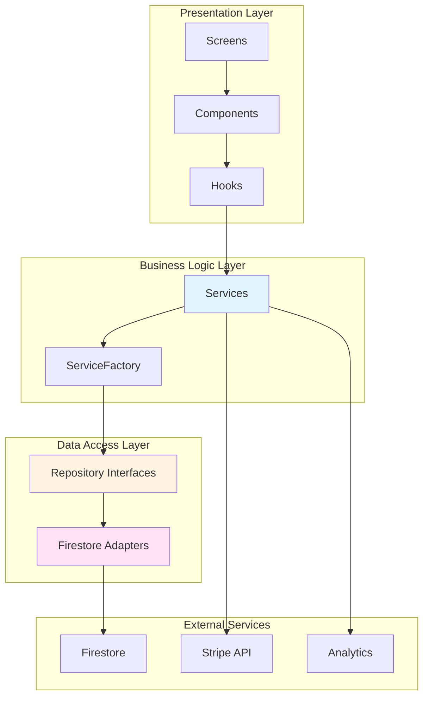
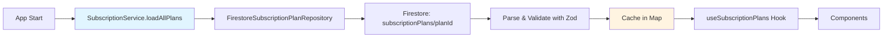
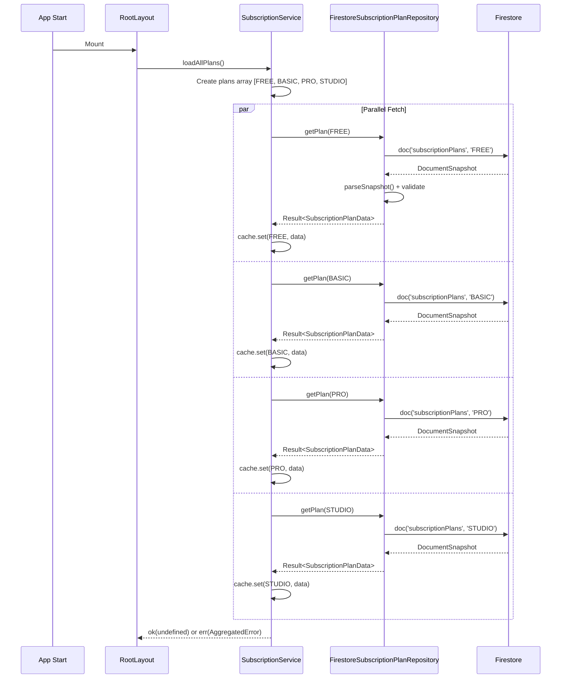
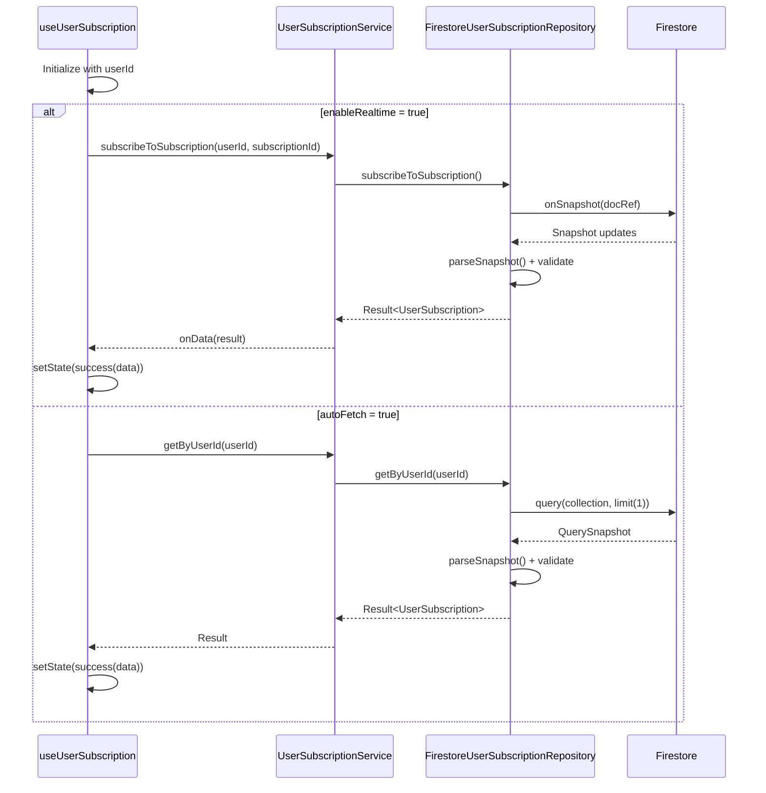
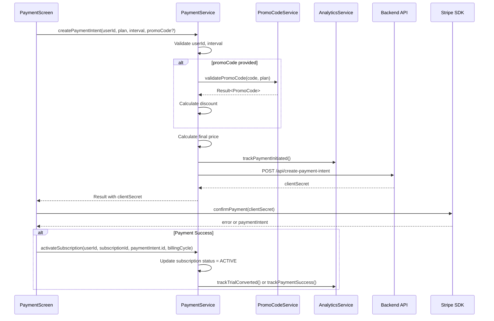
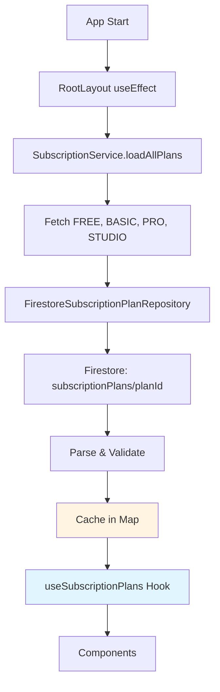
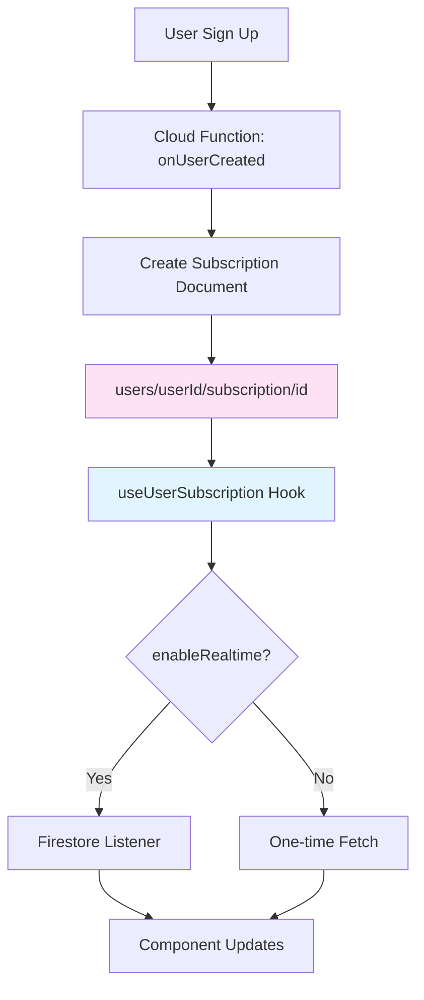
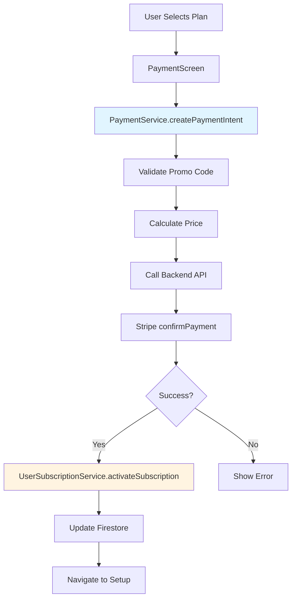

# Subscription Process Analysis Report

**Date**: 2025-11-14  
**Author**: AI Analysis  
**Version**: 1.0.0

---

## Executive Summary

This report provides a comprehensive analysis of the subscription process in the Eye-Doo application, examining adherence to project standards, architecture patterns, error handling, and identifying potential issues.

### Key Findings

✅ **Strengths**:

- Follows Clean Architecture with Ports & Adapters pattern
- Proper use of Result pattern for error handling
- Good separation of concerns (Service → Repository → Firestore)
- Caching mechanism for subscription plans
- Real-time subscription updates via Firestore listeners

⚠️ **Issues Identified**:

- Missing error handling in some components
- Hardcoded values in payment screen
- Inconsistent use of LoadingState pattern
- Missing analytics tracking in some flows
- Subscription gate screen not implemented
- Potential race conditions in plan loading

---

## Table of Contents

1. [Architecture Overview](#architecture-overview)
2. [Subscription Plan Flow](#subscription-plan-flow)
3. [User Subscription Flow](#user-subscription-flow)
4. [Payment Flow](#payment-flow)
5. [Component Analysis](#component-analysis)
6. [Issues & Violations](#issues--violations)
7. [Recommendations](#recommendations)

---

## Architecture Overview

### System Architecture



### Subscription Plan Architecture



---

## Subscription Plan Flow

### 1. Initial Cache Check

**Location**: `src/services/subscription-service.ts`

**Process**:

- Plans are cached in memory using `Map<SubscriptionPlan, SubscriptionPlanData>`
- Cache is checked via `getPlanData(planId)` method
- Returns `null` if plan not loaded

**✅ Adherence**: Correct - Uses in-memory cache, no localStorage

**Code Reference**:

```typescript
private planCache = new Map<SubscriptionPlan, SubscriptionPlanData>();

getPlanData(planId: SubscriptionPlan): SubscriptionPlanData | null {
  return this.planCache.get(planId) ?? null;
}
```

### 2. Fetching Subscription Plans

**Location**: `src/app/_layout.tsx` (line 45)

**Process**:

1. App starts → `RootLayout` component mounts
2. `useEffect` calls `serviceFactory.subscription.loadAllPlans()`
3. Service fetches ALL plans in parallel:
   - FREE
   - BASIC
   - PRO
   - STUDIO
4. Each plan fetched individually from Firestore path: `subscriptionPlans/{planId}`
5. Plans cached individually in Map

**✅ Adherence**:

- ✅ Follows Result pattern
- ✅ Uses ErrorContextBuilder
- ✅ Handles partial failures gracefully
- ⚠️ **Issue**: Non-blocking - errors are swallowed (line 45-51)

**Flow Diagram**:



### 3. Caching Strategy

**Location**: `src/services/subscription-service.ts` (line 24)

**Implementation**:

- In-memory `Map<SubscriptionPlan, SubscriptionPlanData>`
- Cached on successful fetch
- No TTL (persists until app restart)
- No cache invalidation mechanism

**✅ Adherence**:

- ✅ Uses in-memory storage (correct for React Native)
- ⚠️ **Issue**: No cache refresh mechanism
- ⚠️ **Issue**: No error recovery if cache is empty

### 4. Data Parsing & Validation

**Location**: `src/repositories/firestore/firestore-subscription-plan-repository.ts` (line 28-55)

**Process**:

1. Firestore snapshot received
2. Convert Timestamps to Date objects (`convertAllTimestamps`)
3. Validate with Zod schema (`subscriptionPlanSchema`)
4. Return `Result<SubscriptionPlanData, AppError>`

**✅ Adherence**:

- ✅ Defensive parsing (correct)
- ✅ Uses `validateWithSchema` helper
- ✅ Proper error mapping
- ✅ Error context built

**Schema Structure**:

- Plans stored as separate documents: `subscriptionPlans/{planId}`
- Each document contains full `SubscriptionPlanData` schema
- Validated against `plan.schema.ts`

### 5. Hook Usage Pattern

**Location**: `src/hooks/use-subscription-plans.ts`

**Process**:

1. Hook calls `subscription.getPlanData(plan)` for each plan
2. Falls back to constants if cache miss
3. Combines pricing (from constants) with limits (from cache)
4. Returns `ExtendedPlanInfo[]`

**⚠️ Issues**:

- **Line 154**: `setState(success(plans))` is unreachable (inside try block after return)
- **Line 127-152**: Plans array created but not used before return
- **Missing**: No check if plans are loaded before accessing cache

**Code Issue**:

```typescript
const plans: ExtendedPlanInfo[] = plansToFetch.map(plan => {
  // ... create plan object
  return { ... };
});

setState(success(plans)); // ❌ UNREACHABLE - plans already returned above
```

**Should be**:

```typescript
const plans: ExtendedPlanInfo[] = plansToFetch.map(plan => {
  // ... create plan object
  return { ... };
});

setState(success(plans)); // ✅ Moved before return
```

---

## User Subscription Flow

### 1. Subscription Creation

**Location**: Cloud Function `onUserCreated` (server-side)

**Process**:

1. User signs up → Firebase Auth user created
2. Cloud Function triggered automatically
3. Creates subscription document at: `users/{userId}/subscription/{subscriptionId}`
4. Default status: `INACTIVE` for FREE, `TRIALING` for paid plans

**✅ Adherence**:

- ✅ Server-side creation (correct)
- ✅ Follows default values pattern

### 2. Subscription Fetching

**Location**: `src/hooks/use-user-subscription.ts`

**Process**:

1. Hook initialized with `userId` and `service`
2. Options: `autoFetch`, `enableRealtime`, `subscriptionId`
3. If `enableRealtime`: Sets up Firestore listener
4. If `autoFetch`: Fetches once on mount
5. Returns `LoadingState<UserSubscription | null>`

**✅ Adherence**:

- ✅ Uses LoadingState pattern
- ✅ Proper cleanup (unsubscribe on unmount)
- ✅ Error handling with ErrorContextBuilder
- ✅ Optimistic updates supported

**Flow Diagram**:



### 3. Subscription Updates

**Location**: `src/services/user-subscription-service.ts`

**Methods**:

- `activateSubscription()` - After payment success
- `cancelSubscription()` - User cancellation
- `reactivateSubscription()` - Reactivate canceled
- `activateTrial()` - Start trial period
- `checkTrialExpiration()` - Check if trial expired

**✅ Adherence**:

- ✅ All methods return `Result<T, AppError>`
- ✅ Validation at service layer
- ✅ Error context built
- ✅ Analytics tracking integrated
- ✅ Uses date helpers (`calculateNextBillingDate`, `calculateSubscriptionEndDate`)

---

## Payment Flow

### 1. Payment Intent Creation

**Location**: `src/services/payment-service.ts` (line 56)

**Process**:

1. Validate userId, interval
2. Validate promo code (if provided)
3. Calculate price with discount
4. Track analytics: `payment_initiated`
5. Call backend API: `/api/create-payment-intent`
6. Return `clientSecret` for Stripe

**✅ Adherence**:

- ✅ Validation at service layer
- ✅ Error handling with Result pattern
- ✅ Analytics tracking
- ⚠️ **Issue**: Hardcoded API endpoint (line 132)

**Flow Diagram**:



### 2. Price Calculation

**Location**: `src/constants/subscriptions.ts` (line 86)

**Process**:

- Prices stored in `SUBSCRIPTION_PRICING` constant
- Helper function `getPrice(plan, interval)` returns price
- Promo code discount applied in `PaymentService`
- Final amount converted to cents for Stripe

**✅ Adherence**:

- ✅ Uses constants (correct)
- ✅ Helper functions for calculations
- ⚠️ **Issue**: Hardcoded prices (should be configurable)

### 3. Subscription Activation

**Location**: `src/services/user-subscription-service.ts` (line 328)

**Process**:

1. Validate inputs
2. Get current subscription
3. Calculate billing dates using helpers
4. Update subscription:
   - `status: ACTIVE`
   - `isActive: true`
   - `transactionId`
   - `billingCycle`
   - `lastPaymentDate`
   - `nextBillingDate`
   - `endDate`
   - `autoRenew: true`
5. Track analytics

**✅ Adherence**:

- ✅ Proper validation
- ✅ Date calculations use helpers
- ✅ Analytics tracking
- ✅ Error handling

---

## Component Analysis

### 1. PricingScreen (`src/app/(subscription)/pricing.tsx`)

**✅ Strengths**:

- Uses `useSubscriptionPlans` hook
- Proper loading state handling
- Billing interval toggle
- Feature comparison table

**⚠️ Issues**:

- **Line 141**: Hardcoded price calculation (`planPrice = subscription?.plan === 'PRO' ? 19.99 : 49.99`)
- **Line 348**: Accesses `planData.businessCard.nfcEnabled` but schema shows `businessCard` not in plan data
- Missing analytics tracking for plan selection
- No error handling for plan fetch failures

### 2. PaymentScreen (`src/app/(payment)/index.tsx`)

**✅ Strengths**:

- Uses Stripe CardField
- Proper loading states
- Error handling for payment failures

**⚠️ Issues**:

- **Line 141**: Hardcoded price (`planPrice = subscription?.plan === 'PRO' ? 19.99 : 49.99`)
- **Line 106**: Calls `activateSubscription` but doesn't check result
- Missing analytics tracking for payment success
- No promo code input field

### 3. SubscriptionManagementScreen (`src/app/(settings)/subscription.tsx`)

**✅ Strengths**:

- Proper loading states
- Error handling
- Cancel confirmation modal

**⚠️ Issues**:

- **Line 40-54**: Uses try/catch instead of Result pattern
- **Line 49**: `console.error` instead of proper error logging
- Missing analytics tracking

### 4. FeatureComparisonTable (`src/components/subscription/FeatureComparisonTable.tsx`)

**✅ Strengths**:

- Uses `useSubscriptionPlans` hook
- Proper loading indicator
- Groups features by category

**⚠️ Issues**:

- **Line 75**: Accesses `planData?.portalPhotoRequests.maxRequests` but should check `photoRequests.maxPerProject`
- Hardcoded feature list (should be generated from schema)

### 5. SubscriptionGateModal (`src/components/auth/SubscriptionGateModel.tsx`)

**✅ Strengths**:

- Proper modal implementation
- Status-based messaging
- Action buttons

**⚠️ Issues**:

- Not integrated into navigation flow
- Missing analytics tracking

### 6. SubscriptionGate Screen (`src/app/(auth)/subscriptionGate.tsx`)

**❌ Critical Issue**:

- **File is empty** - Only contains comments
- Should check subscription status and gate access
- Should integrate with navigation guard

---

## Issues & Violations

### Critical Issues

1. **Empty Subscription Gate Screen**
   - **File**: `src/app/(auth)/subscriptionGate.tsx`
   - **Issue**: File contains only comments, no implementation
   - **Impact**: No subscription gating mechanism
   - **Fix**: Implement subscription status check and navigation logic

2. **Unreachable Code in useSubscriptionPlans**
   - **File**: `src/hooks/use-subscription-plans.ts` (line 154)
   - **Issue**: `setState(success(plans))` is unreachable
   - **Impact**: Plans never set in state, hook always returns empty array
   - **Fix**: Move `setState` before return statement

3. **Hardcoded Prices**
   - **Files**: `src/app/(payment)/index.tsx` (line 141), `src/app/(subscription)/pricing.tsx` (line 141)
   - **Issue**: Hardcoded price values instead of using constants
   - **Impact**: Prices may not match actual subscription pricing
   - **Fix**: Use `getPrice()` helper from constants

### Architecture Violations

4. **Missing Error Handling**
   - **File**: `src/app/(payment)/index.tsx` (line 106)
   - **Issue**: `activateSubscription` result not checked
   - **Impact**: Payment may succeed but subscription not activated
   - **Fix**: Check result and handle errors

5. **Inconsistent Error Handling**
   - **File**: `src/app/(settings)/subscription.tsx` (line 40-54)
   - **Issue**: Uses try/catch instead of Result pattern
   - **Impact**: Inconsistent error handling across app
   - **Fix**: Use Result pattern or proper error handling hook

6. **Console.log in Production**
   - **Files**: Multiple files use `console.error`/`console.log`
   - **Issue**: Should use `__DEV__` flag or LoggingService
   - **Impact**: Logs in production, potential performance impact
   - **Fix**: Wrap in `__DEV__` checks or use LoggingService

### Missing Features

7. **No Promo Code UI**
   - **File**: `src/app/(payment)/index.tsx`
   - **Issue**: Promo code service exists but no UI input
   - **Impact**: Users cannot apply promo codes
   - **Fix**: Add promo code input field

8. **Missing Analytics Tracking**
   - **Files**: Multiple components
   - **Issue**: Subscription actions not tracked
   - **Impact**: No analytics data for subscription flows
   - **Fix**: Add analytics tracking to all subscription actions

9. **No Cache Refresh Mechanism**
   - **File**: `src/services/subscription-service.ts`
   - **Issue**: Plans cached forever, no way to refresh
   - **Impact**: Plan changes in Firestore not reflected until app restart
   - **Fix**: Add refresh method or TTL

### Data Flow Issues

10. **Incorrect Schema Access**
    - **File**: `src/components/subscription/FeatureComparisonTable.tsx` (line 75)
    - **Issue**: Accesses `portalPhotoRequests.maxRequests` but should be `photoRequests.maxPerProject`
    - **Impact**: Wrong data displayed
    - **Fix**: Correct schema path

11. **Missing Subscription Status Check**
    - **File**: `src/app/(flow-router)/index.tsx`
    - **Issue**: Checks subscription but doesn't handle all statuses
    - **Impact**: Users may be routed incorrectly
    - **Fix**: Add comprehensive status handling

---

## Data Flow Summary

### Subscription Plan Data Flow



### User Subscription Data Flow



### Payment Flow



---

## Navigation & UI Updates

### Navigation Flow

**Location**: `src/app/(flow-router)/index.tsx`

**Process**:

1. Check email verification
2. Get subscription status
3. Get setup status
4. Route based on status:
   - FREE → Projects (skip onboarding)
   - INACTIVE → Payment
   - ACTIVE + firstTimeSetup → Setup
   - TRIALING → Onboarding

**✅ Adherence**:

- ✅ Proper routing logic
- ⚠️ **Issue**: Doesn't handle all subscription statuses (PAST_DUE, CANCELED)

### UI Update Triggers

1. **Real-time Updates**: Firestore listeners update UI automatically
2. **Optimistic Updates**: `useOptimisticUpdate` hook for immediate UI feedback
3. **Manual Refresh**: `refresh()` method in hooks

---

## Promo Code Integration

### Current Implementation

**Location**: `src/services/payment-service.ts` (line 93-114)

**Process**:

1. Validate promo code via `PromoCodeService`
2. Calculate discount percentage
3. Apply to price calculation
4. Record usage after payment success

**✅ Adherence**:

- ✅ Proper validation
- ✅ Error handling
- ⚠️ **Issue**: No UI for promo code input

### Schema

**Location**: `src/domain/subscription/promo-code.schema.ts`

**Structure**:

- `PromoCode`: Code, discount, max uses, validity dates
- `PromoCodeUsage`: Usage tracking

**✅ Adherence**:

- ✅ Proper Zod schema
- ✅ Type safety

---

## Analytics Tracking

### Current Implementation

**Location**: `src/services/analytics-service.ts`

**Events Tracked**:

- ✅ `payment_initiated` - PaymentService
- ✅ `trial_started` - UserSubscriptionService
- ✅ `trial_ended` - UserSubscriptionService
- ✅ `trial_converted` - UserSubscriptionService
- ✅ `subscription_cancelled` - UserSubscriptionService
- ✅ `subscription_reactivated` - UserSubscriptionService

**Missing Events**:

- ❌ `pricing_page_viewed` - PricingScreen
- ❌ `plan_selected` - PricingScreen
- ❌ `payment_success` - PaymentScreen (after Stripe success)
- ❌ `subscription_viewed` - SubscriptionManagementScreen
- ❌ `upgrade_modal_shown` - UpgradeModal

---

## Subscription Document Structure

### Firestore Path

**User Subscription**: `users/{userId}/subscription/{subscriptionId}`

**Plan Data**: `subscriptionPlans/{planId}`

### Document Fields

**UserSubscription**:

- `id`, `userId`
- `plan` (SubscriptionPlan enum)
- `status` (SubscriptionStatus enum)
- `billingCycle` (PaymentInterval enum)
- `isActive` (boolean)
- `autoRenew` (boolean)
- `trialEndsAt` (Date | null)
- `lastPaymentDate` (Date | null)
- `nextBillingDate` (Date | null)
- `endDate` (Date | null)
- `canceledAt` (Date | null)
- `transactionId` (string | null)
- `createdAt`, `updatedAt`

**SubscriptionPlanData**:

- `id`, `planName`
- `priceMonthly`, `priceAnnual`
- `trialDays`
- Feature limits (projects, clientPortal, etc.)
- `offlineSync`, `postTrialBehavior`

---

## Recommendations

### Immediate Fixes

1. **Fix useSubscriptionPlans Hook**

   ```typescript
   // Move setState before return
   const plans: ExtendedPlanInfo[] = plansToFetch.map(plan => {
     // ... create plan object
   });

   setState(success(plans)); // ✅ Before return
   ```

2. **Remove Hardcoded Prices**

   ```typescript
   // Use helper function
   const planPrice = getPrice(subscription.plan, subscription.billingCycle);
   ```

3. **Implement Subscription Gate Screen**
   - Check subscription status
   - Show appropriate modal/message
   - Route to payment if needed

4. **Add Error Handling**
   ```typescript
   const result = await userSubscription.activateSubscription(...);
   if (!result.success) {
     handleError(result.error);
     return;
   }
   ```

### Architecture Improvements

5. **Add Cache Refresh**

   ```typescript
   async refreshPlans(): Promise<Result<void, AppError>> {
     this.planCache.clear();
     return await this.loadAllPlans();
   }
   ```

6. **Add Promo Code UI**
   - Input field in PaymentScreen
   - Validation feedback
   - Discount display

7. **Comprehensive Analytics**
   - Track all subscription actions
   - Track user journey through subscription flow
   - Track conversion rates

### Code Quality

8. **Replace console.log**

   ```typescript
   if (__DEV__) {
     console.log(...);
   }
   // OR
   LoggingService.error(...);
   ```

9. **Consistent Error Handling**
   - Use Result pattern everywhere
   - Or use error handling hooks consistently

10. **Fix Schema Access**
    - Verify all schema paths
    - Use type-safe accessors

---

## Conclusion

The subscription system follows good architectural patterns but has several critical issues that need immediate attention:

1. **Critical**: Empty subscription gate screen
2. **Critical**: Unreachable code in useSubscriptionPlans hook
3. **High**: Hardcoded prices
4. **High**: Missing error handling in payment flow
5. **Medium**: Missing analytics tracking
6. **Medium**: No promo code UI

The architecture is sound, but implementation details need refinement to match project standards.

---

## Appendix: File Reference Map

| Component                    | File Path                                                | Status          |
| ---------------------------- | -------------------------------------------------------- | --------------- |
| SubscriptionService          | `src/services/subscription-service.ts`                   | ✅ Good         |
| UserSubscriptionService      | `src/services/user-subscription-service.ts`              | ✅ Good         |
| PaymentService               | `src/services/payment-service.ts`                        | ⚠️ Issues       |
| useSubscriptionPlans         | `src/hooks/use-subscription-plans.ts`                    | ❌ Critical Bug |
| useUserSubscription          | `src/hooks/use-user-subscription.ts`                     | ✅ Good         |
| PricingScreen                | `src/app/(subscription)/pricing.tsx`                     | ⚠️ Issues       |
| PaymentScreen                | `src/app/(payment)/index.tsx`                            | ⚠️ Issues       |
| SubscriptionManagementScreen | `src/app/(settings)/subscription.tsx`                    | ⚠️ Issues       |
| SubscriptionGateScreen       | `src/app/(auth)/subscriptionGate.tsx`                    | ❌ Empty        |
| FeatureComparisonTable       | `src/components/subscription/FeatureComparisonTable.tsx` | ⚠️ Issues       |
| SubscriptionGateModal        | `src/components/auth/SubscriptionGateModel.tsx`          | ✅ Good         |

---

**End of Report**
