# User Journey: Welcome Screen to Projects Screen

This document maps all possible user paths from the welcome screen (`src/app/(auth)/welcome.tsx`) to the projects screen (`src/app/(projects)/index.tsx`), including component-level flowcharts, data lineage, infrastructure, and interaction sequences.

## Overview

The Eye-Doo app follows a complex authentication and onboarding flow with multiple routing guards that determine user progression based on authentication status, email verification, subscription state, and setup completion.

## Main User Paths

### Path 1: New User Registration Flow
```
Welcome → Register → Email Verification → Pricing → Onboarding → Setup → Projects
```

### Path 2: Existing User Sign-In Flow
```
Welcome → Sign In → [Various Routes Based on State] → Projects
```

### Path 3: Trial User Flow
```
Welcome → Register/Sign In → Trial Onboarding → Setup → Projects
```

## Component-Level Architecture

### Core Components Involved

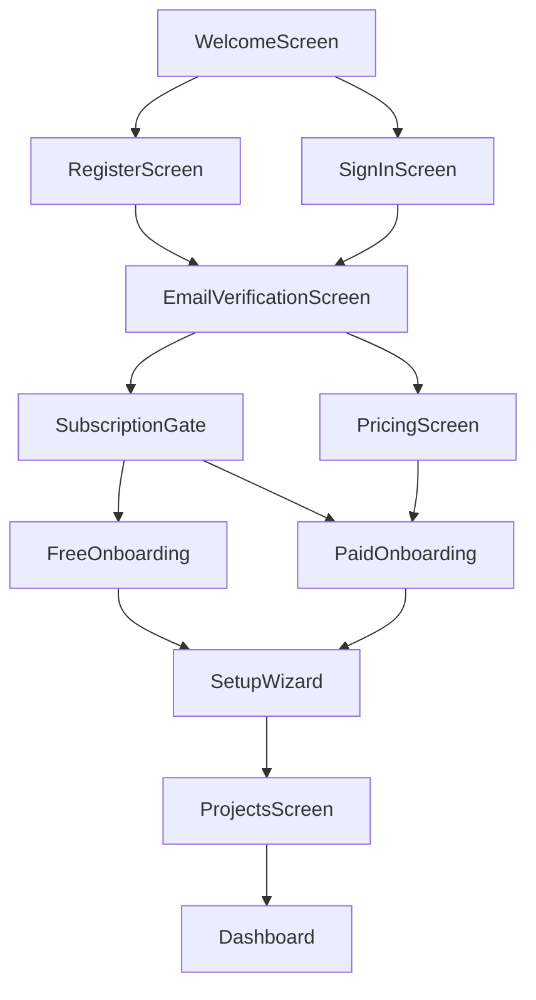

## Data Flow and Infrastructure

### Authentication Infrastructure

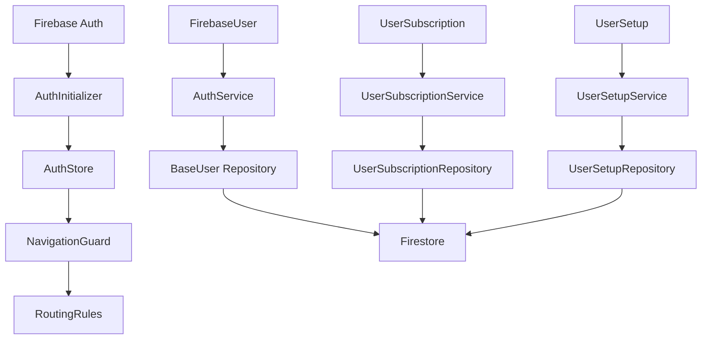

### Service Layer Architecture

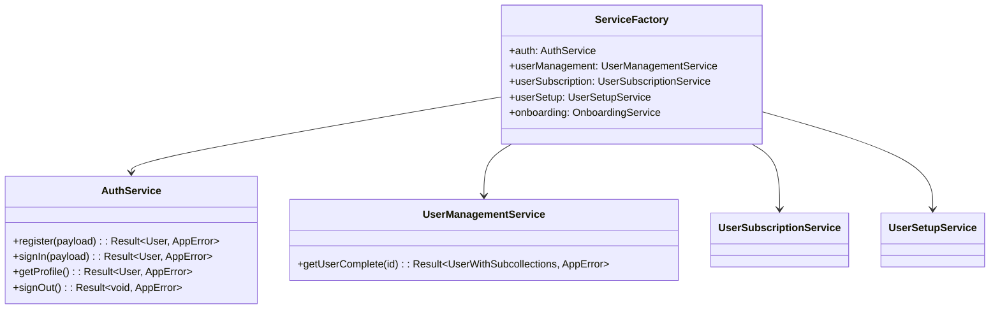

## Detailed Sequence Diagrams

### New User Registration Sequence

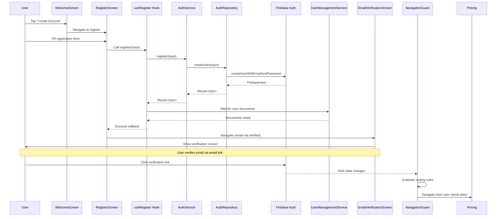

### Sign-In Sequence

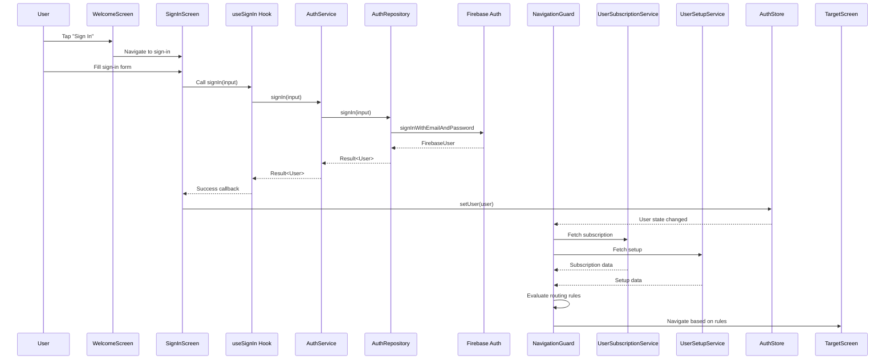

## Routing Rules Engine

### Priority-Based Routing System

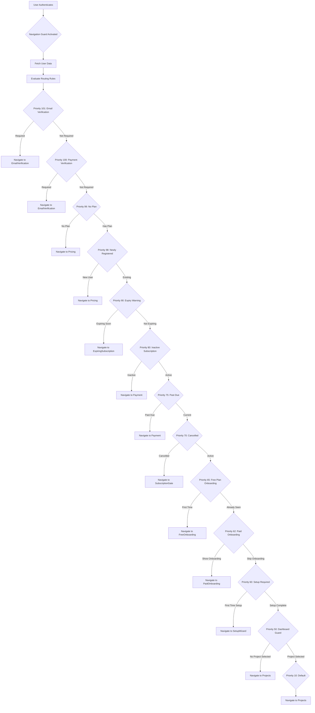

### Routing Rule Conditions

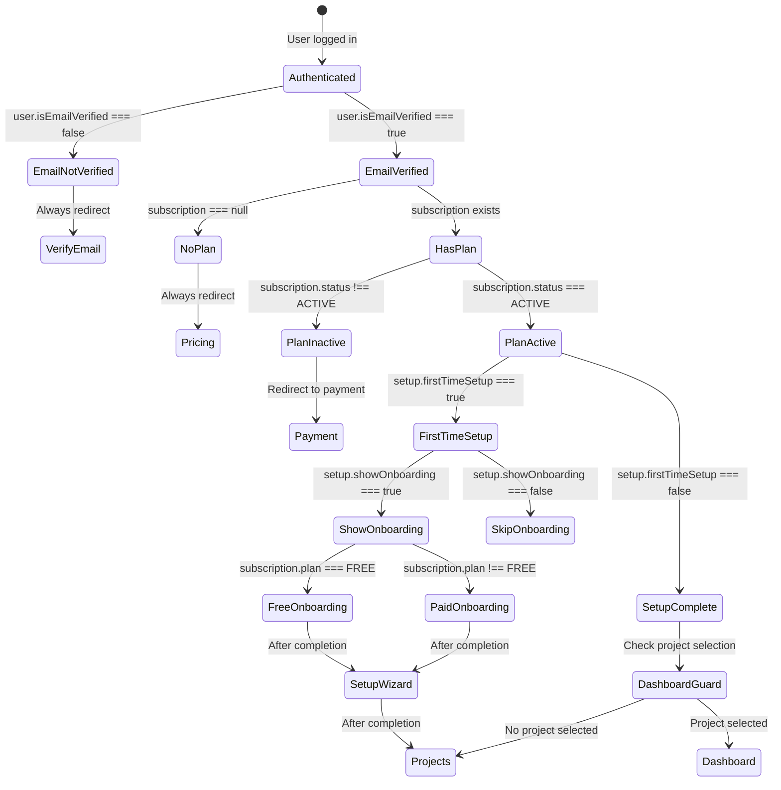

## Hook and Component Interactions

### Authentication Hooks Flow

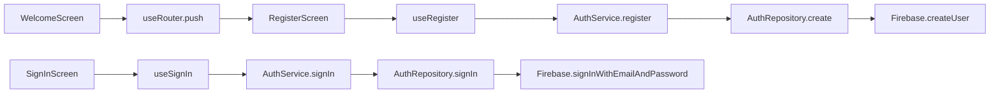

### State Management Flow

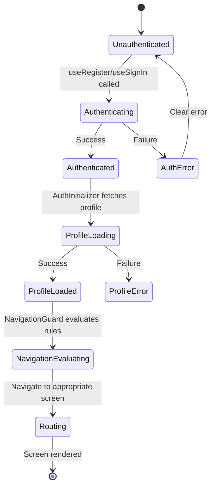

## Data Lineage and Dependencies

### User Data Structure

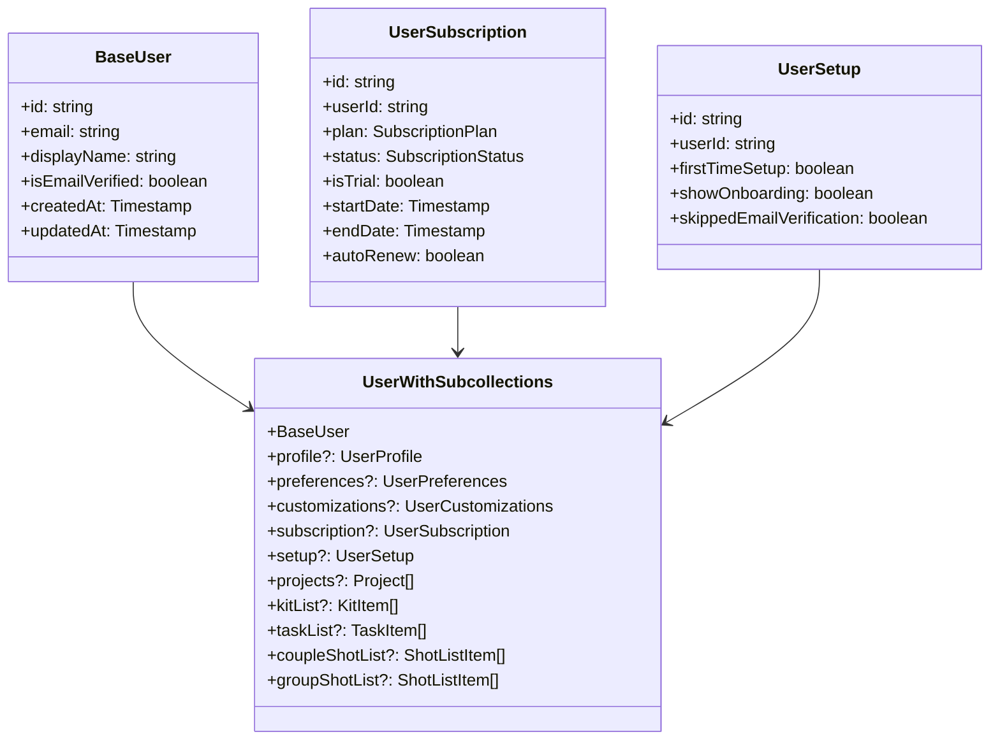

### Repository Pattern Implementation

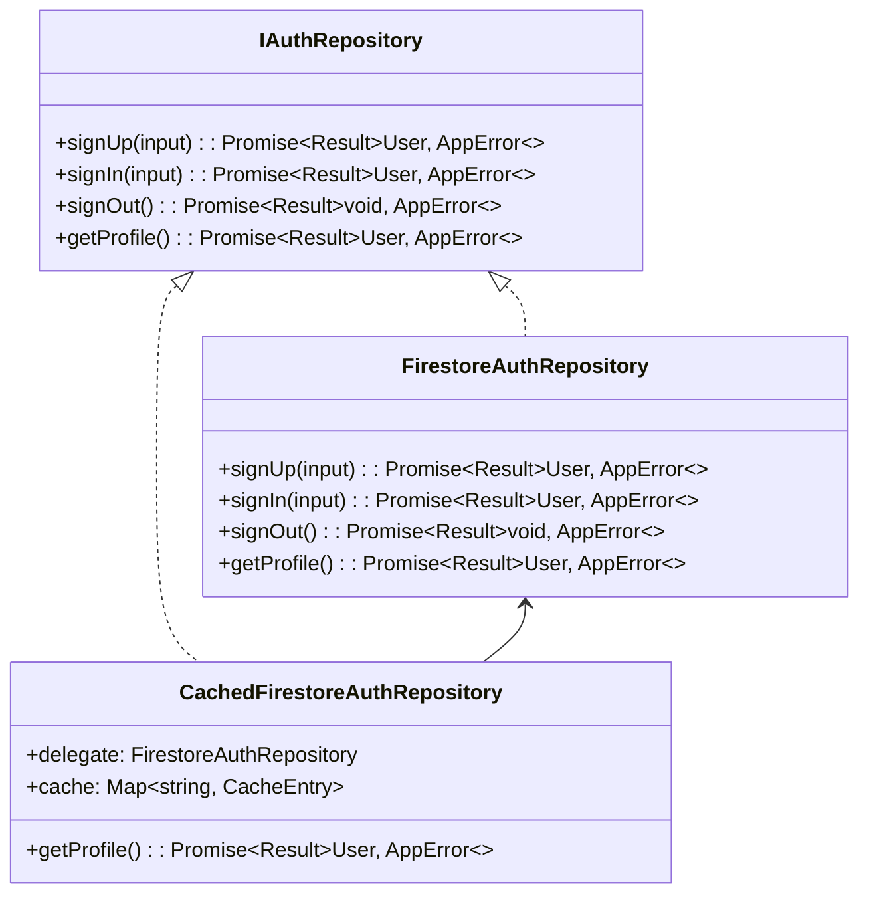

## Error Handling and Recovery

### Error Flow Architecture

```mermaid
graph TD
    A[User Action] --> B[Component/Hook]
    B --> C[Service Method]
    C --> D[Repository Method]
    D --> E[Firestore Operation]

    E -->|Success| F[Return Result.ok(data)]
    E -->|Error| G[ErrorMapper.fromFirestore]

    G --> H[AppError with context]
    H --> I[Result.err(error)]
    I --> J[Error boundary/Global handler]

    J --> K{Error Type}
    K -->|Recoverable| L[Show retry option]
    K -->|Fatal| M[Show error screen]
    K -->|Auth| N[Redirect to sign-in]
```

## Infrastructure Components

### Service Context and Dependency Injection

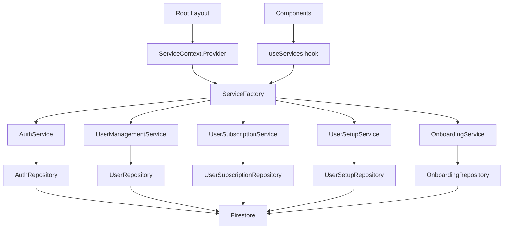

### Navigation State Management

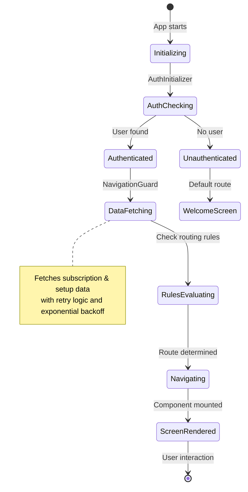

## Key Component Interactions

### Screen Wrapper Pattern

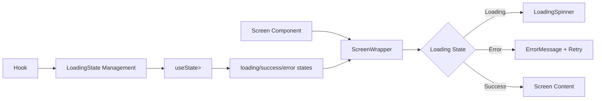

### Form Component Pattern

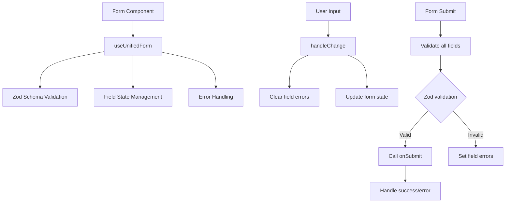

## Performance Optimizations

### Loading State Management

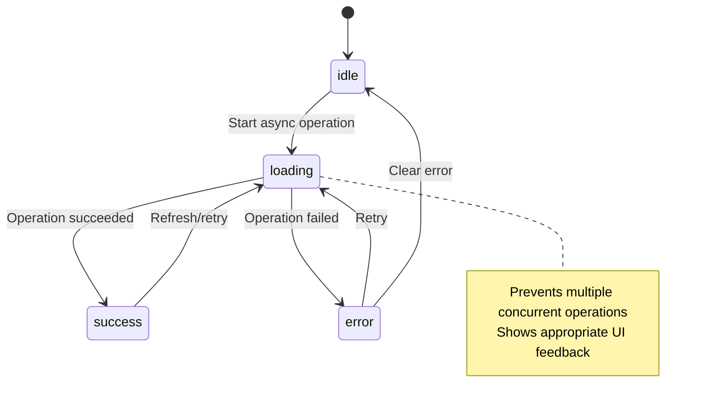

### Optimistic Updates Pattern

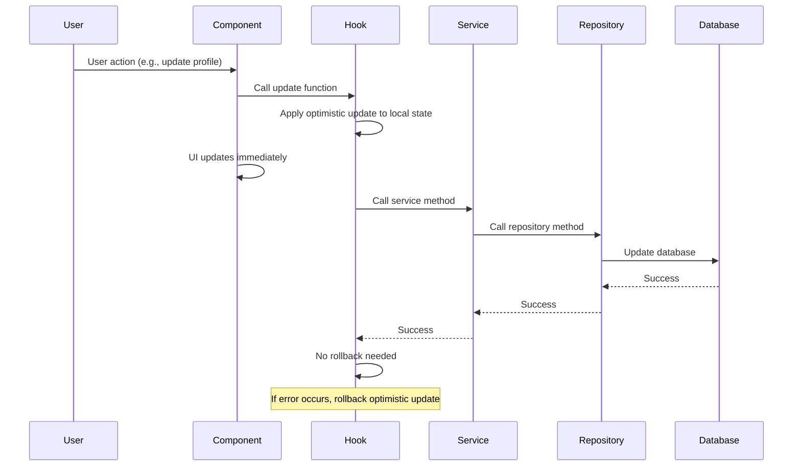

## Security Considerations

### Authentication Guards

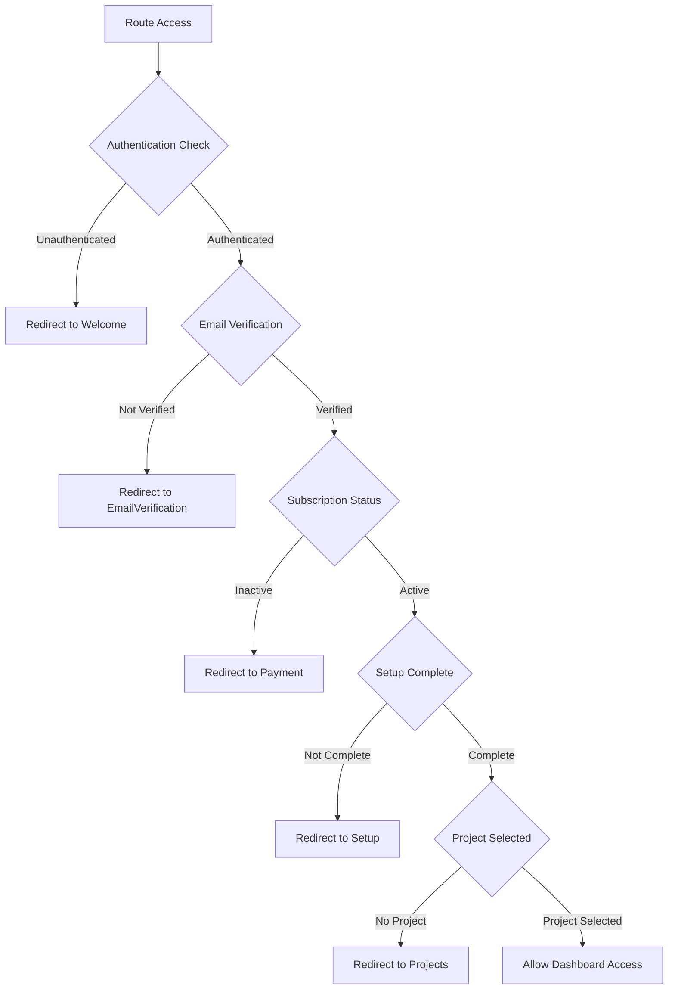

### Data Sanitization Pipeline

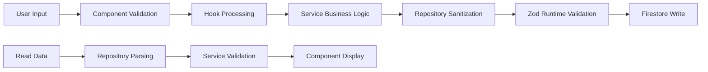

## Testing Strategy

### Test Coverage Areas

```mermaid
graph TD
    A[Unit Tests] --> B[Hooks]
    A --> C[Services]
    A --> D[Repositories]
    A --> E[Utilities]

    F[Integration Tests] --> G[Authentication Flow]
    F --> H[Navigation Flow]
    F --> I[Onboarding Flow]

    J[E2E Tests] --> K[User Registration]
    J --> L[User Sign In]
    J --> M[Complete Onboarding]
    J --> N[Project Creation]

    O[Test Utilities] --> P[Mock Services]
    O --> Q[Test Data Factories]
    O --> R[Firebase Emulators]
```

## Monitoring and Analytics

### User Journey Tracking

```mermaid
sequenceDiagram
    participant U as User
    participant A as Analytics
    participant S as Screen
    participant H as Hook
    participant E as Event

    U->>S: Navigate to screen
    S->>A: trackScreenView
    A->>A: Log screen view event

    U->>H: Perform action
    H->>A: trackEvent
    A->>A: Log custom event

    E->>A: Error occurs
    A->>A: Log error event

    Note over A: Events include:
    Note over A: - Screen views
    Note over A: - Button clicks
    Note over A: - Form submissions
    Note over A: - Navigation events
    Note over A: - Error events
```

This comprehensive mapping shows the complete user journey from welcome screen to projects screen, including all possible paths, component interactions, data flows, and infrastructure components involved in the Eye-Doo application.
